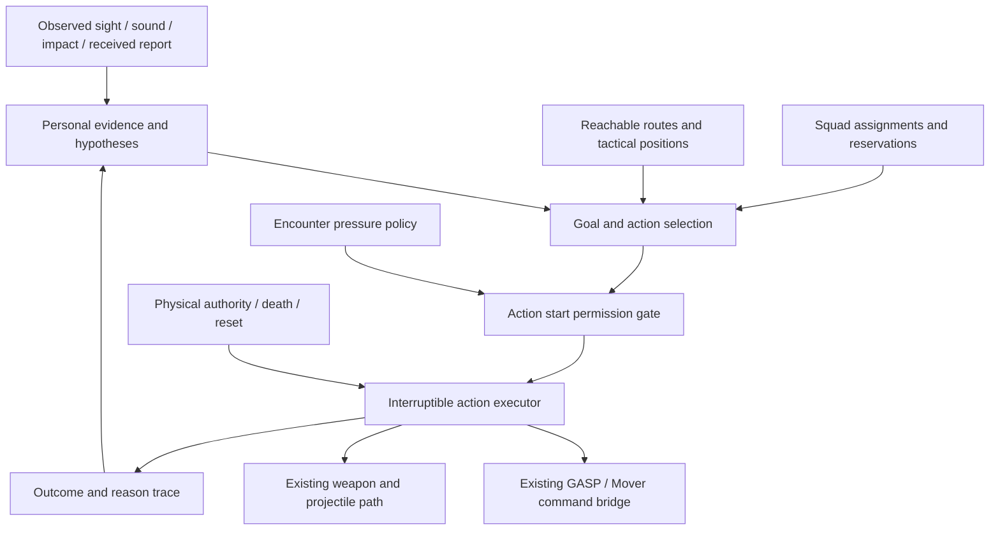

# CombatAI01: surprising arcade combat AI

Date: 2026-09-23. Status: implementation proposal prepared at the owner's request.
Companion: [ordered implementation packages](../Tasks/CombatAI01Plan.md).
Authority: [exact owner request](../Approvals/CombatAI01-Planning01.json).

Later administrative update: the owner requested task formalization. The
[MSQ-101 family](../Tasks/CombatAI01.md) now maps this design to 16 prepared backlog
tasks under the [task-creation decision](../Approvals/CombatAI01-TaskCreation01.json).
Gameplay implementation has not started; the original planning scope below describes
the design package itself, not the later administrative setup.

## 1. Product intent and decision status

Make opponents create memorable, understandable combat situations through initiative,
cooperation and responses to the player's actions. The player should feel challenged,
capable of improvising and rewarded for disrupting an enemy plan. The owner's ambition
is the best AI in shooters, with surprise as the distinguishing quality. That ambition
is a development direction; no comparative quality claim has been demonstrated.

**Owner requirements:** arcade combat; surprise without oppressive difficulty; enemies
can run; confirmed threats produce persistent searching; footsteps matter; incoming
shots help an enemy determine where the attack originates. Existing world-time,
physical reaction, finite-projectile and preservation rules remain applicable.

**Recommended design:** limited sensory knowledge, permanent encounter alert after
confirmed contact, cooperative actions, readable commitments, pressure scheduling and
bounded variation among sensible choices. The owner has not separately selected an
omniscience policy; limited knowledge is the explicit working assumption of this plan.
Numbers, class names, roles, action sets and release order below are proposals.

This package plans implementation. It creates no Multica issues, starts no production
run, changes no gameplay and does not approve new environment or character production.
The newer search direction supersedes finite disengagement as the intended future
behavior; the delivered MSQ-70 candidate and its evidence remain unchanged.

## 2. Player experience contract

| Pillar | Observable result | Failure we must detect |
| --- | --- | --- |
| Initiative | An enemy advances, changes angle or investigates without waiting for another hit | Standing indefinitely because one shot/path condition failed |
| Persistent intent | Breaking sight creates a search that continues through new areas | A timeout restores idle/home and erases the fight |
| Understandable surprise | An unexpected arrival or cooperative action has an explainable route and cause | A teleport, unexplained rear attack or arbitrary random action |
| Player agency | Movement, shooting, abilities and deception can interrupt or exploit enemy decisions | Unavoidable damage or instant counters to every player choice |
| Cooperation | Enemies coordinate timing, space and information | Several independent enemies running the same route |
| Rhythm | Peaks, transitions and useful openings occur within the fight | Constant maximum pressure or obviously inactive enemies waiting in a queue |
| Physical coherence | Injury, falling, recovery and broken cover change available actions | A fallen enemy still firing or a stale tactical position surviving destruction |

The plan does not optimize kill rate alone. A difficult encounter that repeatedly
forces the player to wait in safety is a design failure for this arcade direction.
Enemies may be fooled and may choose a reasonable action that turns out badly.

## 3. Starting point and known limits

The baseline is [MSQ-70 Candidate01/build03](../EnemyCombat01.md), using the current
GASP/Mover foundation, GASPALS rifle presentation and subsequent physical corrections.
The installed engine reports UE **5.8.3**, changelist **58210709**. This planning audit
inspected source and documents; it did not run the game or measure motion/performance.

| Existing element | Retain or evolve |
| --- | --- |
| `UEnemyCombatComponent` | Retain as the integration facade; progressively separate evidence, choices and action execution |
| `AGASPEnemyFixture` and foundation command bridge | Retain sole AI input route and physical authority handover |
| GASPALS Relax/Ready/Aim, crouch and independent aim | Reuse demonstrated capabilities; verify any new moving-fire/peek composition |
| `ACombatProjectileWorld` | Retain accepted shot identity, finite flight, contact ordering, damage and reset semantics |
| Current one-enemy mode, passive fixtures and F6 | Keep repeatable owner test entrypoints and explicit reset generations |
| Local A* navigation | Temporary fallback: one layer, 28 m home radius, 80 cm cells; insufficient as the long-term encounter topology |
| Search/return policy | Replace four-second expiry and memory-clearing return; preserve bounded work per attempt |
| Path gait | Current follower always requests walking; existing command bridge accepts a non-walk request |
| Awareness | Sight currently refreshes the only remembered position; no native hearing/stimulus producers found |
| Damage reaction | Physical response exists; damage does not currently notify tactical awareness |
| Health and content | Player health/death, encounter lifecycle and real ability/destruction specimens have separate unfinished tasks |

Source anchors: [combat component](../../Source/MeridianSquad/EnemyCombatComponent.cpp),
[navigation](../../Source/MeridianSquad/EnemyCombatNavigation.cpp),
[fixture](../../Source/MeridianSquad/GASPEnemyFixture.cpp),
[projectiles](../../Source/MeridianSquad/CombatProjectileWorld.cpp).
Audible Blueprint footsteps were not audited; absence of native sensory events does
not mean the player currently has no audible footstep sound.

## 4. Architecture and ownership

Use a small native architecture built around explicit evidence and actions. Start with
utility selection: filter actions by validity, then score the available choices.
Keep action execution deterministic for a given input stream and seed. Introduce
multi-step planning only when demonstrated action dependencies require it.

| Layer | Owns | Boundary |
| --- | --- | --- |
| Stimulus ingress | Typed events, IDs, timestamps, spatial routing and bounded delivery | Attribution metadata cannot become hidden target-position knowledge |
| Personal knowledge | Confirmed threat, sightings, sound regions, hit bearings, search coverage | Only validated observations and delivered reports update target hypotheses |
| Tactical spatial service | Paths, candidate positions, exposure, reservations and local invalidation | Reads physical geometry; supplies no unseen player transform |
| Decision policy | Goal priorities, action scores, commitment and remembered failures | Operates on a knowledge snapshot and available capabilities |
| Action executor | Start/update/abort/finish, movement/weapon intents, cleanup | Does not directly place actors or override physical recovery |
| Squad coordinator | Task allocation, friendly reservations, delivered shared observations | Has no perfect group target knowledge beyond member evidence |
| Encounter pressure policy | Permits and delays for new high-pressure commitments | Cannot inject observations, change landed damage or cancel bullets in flight |
| Presentation | Motion, weapon poses, barks and physical cues tied to real action state | A bark is not evidence that an action succeeded |

Suggested implementation units, created only when their package needs them:
`FCombatStimulus`, `FEnemyKnowledge`, `FEnemyActionRuntime`,
`FEnemyTacticalPosition`, a navigation adapter, `UCombatStimulusSubsystem` and a
combined encounter/squad coordinator with separate policy records. Keep the existing
component as caller and debug facade. Prefer plain structs and services before adding
many ticking components. All names are proposed, not existing APIs.

State is split into independent dimensions:

- **Encounter awareness:** unaware, investigating an unconfirmed clue, confirmed alert.
- **Target evidence:** visible, recently inferred, uncertain area, unlocated.
- **Current action:** move, search, fire, reload, reposition, support or another valid action.
- **Physical authority:** the adopted Locomotion/Recovery/Falling/Down/GettingUp/Dead states.

A physical interruption does not erase alertness. An expired observation does not end
the encounter. A failed movement attempt does not imply the threat disappeared.

## 5. Evidence model and knowledge boundary

Each evidence record contains event ID, encounter generation, occurrence world time,
receipt world time, event type, observed position/region or bearing, confidence,
localization error, observer, allowed target identity and provenance. Store source
actor handles for lifecycle/attribution separately from position data available to AI.
Reject stale-generation events and duplicate IDs before updating knowledge.

Maintain a small set of spatial hypotheses, initially at most four per active target:
last observed route, nearby reachable exits, a newly heard region and a conflicting
report. Each has confidence, uncertainty, age, supporting evidence and search coverage.
Confidence decays and the possible region expands along reachable routes. Do not
expand an unrestricted circle through walls. New strong evidence can replace weak
inferences; silence alone cannot provide a precise new location.

| Input | Legitimate information | Restrictions |
| --- | --- | --- |
| Direct sight | Visible target samples, observed velocity, posture and actions | Refresh only while visibility succeeds; brief extrapolation is bounded |
| Footstep | Sound category, approximate source region, freshness | Hearing an actor-owned event does not automatically identify the player |
| Gunshot | Audible firing region; visual muzzle flash if actually seen | A shot event retains its emission position, never a live shooter-position getter |
| Incoming hit | Impact position, incoming bearing, severity and confirmed hostile attack | A bearing alone does not reveal range or an exact point behind a wall |
| Near miss | Locally perceived danger and approximate bearing | No global projectile scan granting omniscient evasion |
| Object impact | Suspicious region and intensity | It may be a distraction or environmental noise |
| Squad report | Sender's observation, original age, uncertainty and receipt time | Relay cannot increase confidence or reset the original observation age |
| Checked empty area | Reduced confidence in the actually inspected visible space | Visiting a room entrance does not reveal occluded corners |

Knowledge checks must include paired tests where the hidden player moves differently
while the enemy receives identical evidence: target beliefs and the proposed target
regions, routes and aim points must remain identical until a new observation arrives.
Compare this invariant before the pressure/fairness start gate. The separate gate may
delay execution using privileged fairness inputs, but cannot change those proposals.
Physical collision queries may still veto an unsafe move; they cannot manufacture a
new aim point. Replay captures sensory inputs and privileged fairness inputs in
separate records so both the knowledge invariant and execution timing can be checked.

## 6. Sensing implementation

### Sight

Reuse current scene obstruction and launch checks. Replace the single player-view
sample with a bounded sequence of appropriate body samples, such as torso and head,
only when needed. Separate acquisition from retention: losing one sample for one
sense update does not erase the observation. It also never authorizes shooting
through solid geometry. Preserve a configurable reaction delay and angular turn rate.

Track observed movement rather than reading player input, camera aim, ammo or ability
cooldowns. A visible/audible reload can create an opportunity; the internal reload flag
must not leak to every opponent. For direct fire, target identity/visibility and actual
launch clearance are rechecked at shot time regardless of the perception frequency.
Evidence-backed region suppression has the separate contract in section 10 and never
weakens the direct-fire visibility requirement.

### Sound

Produce gameplay sound events from actual movement/weapon/impact occurrences.
Use a verified foot-contact notify if one exists; otherwise use a movement-based
stride accumulator gated by grounded travel, stance and speed. Prevent duplicate
notify/distance emissions. Airborne travel produces no footsteps; landing emits once.
Standing still, colliding without progress and restarting the encounter emit none.

Render audio and gameplay stimuli are separate consumers of the same source event.
Audio muting, virtualized voices and reduced effects settings must not silently alter
AI hearing. Their location and cadence must still agree for the player.

First implementation: distance/loudness filter plus bounded occlusion attenuation and
position uncertainty. A trace is not a complete acoustic propagation simulation. For
the retained lobby, verify representative open and column-obstructed cases. Later
connected-room topology can propagate through validated openings with material/door
attenuation; do not claim doorway localization from a single straight trace.

Repeated noises merge into bounded evidence. Gunfire can mask weak footsteps through
a tunable recent-noise threshold; avoid simulating a full acoustic engine. Enemy and
prop events have source categories so friendly footsteps do not continually reset a
player pursuit. Suspicious unidentified sounds remain useful investigation targets.

### Fire, damage and immediate danger

Emit one gunshot stimulus at accepted launch. Emit impact/damage evidence at the
existing resolved contact, using the actual incoming segment direction. Add near-miss
events later from bounded local segment queries when suppression needs them. Keep
the current sorted contact timeline and once-only damage behavior authoritative.

Normalize damage evidence before a physical suspension can bypass the combat update.
The threat record survives knockdown; movement/firing remain suspended while physical
authority requires it. Friendly/self/environment damage does not automatically become
a precise player sighting. Lethal events cancel intents and release reservations.

Projectile simulation/contact timestamps are not assumed to equal the ordinary
world clock. Carry contact identity/time and world occurrence/receipt fields separately
until a tested conversion is established. Tactical delivery is queued outside contact
iteration; it cannot reorder damage or mutate a reset projectile batch. Near-pass
queries stop at the earliest collision and never examine the unused segment behind it.

## 7. Persistent search with changing intensity

Confirmed contact latches alert until enemy death, explicit encounter completion,
encounter reset or a declared lifecycle transition. There is no automatic return to
an unaware state after a few seconds. A combatant may withdraw to a useful position
while remaining alert and searching.

The recurring search cycle is:

1. Approach or observe the last reliable region using a viable route.
2. Check likely departures using the last observed movement and map connectivity.
3. Inspect unverified reachable sectors, recording actual visibility coverage.
4. Listen and watch exits while selecting the next useful sector.
5. Merge new evidence, widen uncertain hypotheses and resume the cycle.

Search prioritizes information gain, evidence freshness, travel cost, local danger and
coverage by allies. It includes deliberate listening/observation intervals, but no
terminal 'give up' timer. Negative evidence gradually expires because the player can
return to a previously cleared area. Keep a bounded history and prefer unexamined
sectors before repeating identical sweeps.

If no route reaches a hypothesis, record why, inspect reachable borders or alternate
exits, and retry only after relevant geometry/evidence changes or a bounded backoff.
The enemy must not repeatedly run into the same obstruction. Per-query time/node
budgets remain mandatory. Persistent intent does not imply unbounded computation.

For an unloaded sector, retain a small alert/evidence summary if encounter streaming
is later implemented. No offscreen actor teleport or hidden accurate pursuit simulation
is needed for the current single loaded lobby. Full-world persistence/save games are
outside this first program.

## 8. Movement and tactical space

First deliver explicit gait selection through the existing command bridge. Run when
crossing exposure, closing useful distance or changing position; use controlled speed
near a firing position, inspection point or tight corner. Validate the actual GASP gait
mapping and transitions. Do not make a new movement system merely to enable running.

Replace the home-centered grid as the primary encounter navigator with **Unreal Recast
path queries feeding the existing GASP/Mover command executor**. Begin with removable
navigation/gameplay setup and preserved map bytes. Include `NavigationSystem` and
`AIModule` only where actually used. Validate capsule dimensions, floor projection,
path smoothing, partial paths and actor displacement after recovery.

UE 5.8 provides `UNavMoverComponent`; installed source exposes request/consume seams.
Our custom controller/input producer is not automatically connected to standard
`MoveTo`. The first adapter does not require that migration. Evaluate engine path
following/NavMover separately if it reduces verified maintenance cost. Epic currently
documents Mover as experimental and does not claim RVO support for it. [Mover source
reference](https://dev.epicgames.com/documentation/unreal-engine/mover-features-and-concepts-in-unreal-engine).

Use topology to discover genuinely different routes. Penalizing the current path's
occupied corridor can yield alternatives; small coordinate jitter on the same route
does not count as a flank. The retained geometry must actually contain the required
route. Missing space becomes a documented encounter constraint, never a reason to
silently remodel the lobby.

Tactical positions begin with a small set of removable authored anchors plus local
geometry validation. Each stores position, stance support, cover orientation, firing
samples, approach/exits, reservation and geometry revision. Score exposure to the
known threat region, useful range, ally lanes and escape options. An anchor is usable
only while the capsule, cover and muzzle geometry agree.

Use reservations and local yielding for the first three enemies. Do not assume
CharacterMovement RVO or a stock crowd component works with this pawn. A waiting
agent should hold a useful sector or choose another route. Movement/collision must
remain authoritative; reservations do not disable collision.

## 9. Decision policy and action contracts

The first selector uses a bounded candidate set and an explainable score:

`utility = objective value + information gain + position value + team contribution`
`          - exposure - travel cost - resource risk - recent repetition`

Normalize terms by action type. Invalid physical capability, weapon state or route
removes the candidate before scoring. Pressure/fairness permissions gate execution
after a proposal is selected; privileged fairness inputs never enter utility scores,
target regions, route selection or aim generation. Use a minimum commitment and score
hysteresis to prevent jitter. Randomness selects among a few comparably good choices
at decision boundaries, with a recorded seed. It never rescues an invalid action.

Every action defines preconditions, intent, used resource slots, commitment point,
interrupt conditions, success evidence, failure reason, cooldown and cleanup.
Movement and weapon slots may be shared only by explicitly compatible actions.
Current stationary firing gates remain until moving-fire presentation is verified.

| Initial action | Completion evidence | Typical interruption/fallback |
| --- | --- | --- |
| MoveToRegion | Reach valid inspection/attack region | Route changes: stop safely, choose another reachable region |
| ObserveSector | Inspect assigned visible samples for declared duration | Stronger clue: update region without clearing alert |
| InvestigateSound | Check uncertain sound region and exits | Sight/damage: prioritize confirmed threat |
| Reposition | Reach a materially different valid angle | Cover invalidation: abandon position and reserve replacement |
| AimAndBurst | Accepted projectile launches and burst completion | Loss of valid target/geometry: stop launch, keep search evidence |
| ReloadSafely | Existing ammo commit completes once | Physics/death/reset: cancel under retained weapon policy |
| HoldExit | Observe a plausible route while allies search | New evidence or stalled assignment: redistribute roles |
| SupportAdvance | Fire permitted suppression while ally crosses | Friendly lane unsafe or cover lost: suspend fire and report |
| Flank | Reach alternative angle with fresh launch validation | Evidence invalidates route, ally lost or pressure permit revoked |
| WithdrawAndReengage | Reach safer position and resume useful action | Never becomes an automatic home/forget action |

Priority order: reset/death and physical authority; immediate observed danger and
weapon validity; committed action safety; current combat/search goal; optional style.
No generic long animation blocks a required physical interruption. All action releases
are idempotent; cleanup may be called after failure and again during reset.

A future GOAP/HTN implementation is justified only by cases such as repeated
multi-step dependencies that the action selector cannot express cleanly. Benchmark a
bounded prototype against the existing actions and debugging quality first. No LLM,
online model, paid inference or learned runtime policy is required for this design.

## 10. Weapon behavior and believable pressure

Retain finite-flight projectiles and real muzzle/scene obstruction. Tune reaction,
aim settling, angular tracking, burst length and exposed firing time independently.
Use observed velocity only for bounded prediction; break prediction when evidence
ages or the target changes direction unseen. Do not snap to the head after reacquiring.

Reloading should create an understandable opportunity. An enemy may move to cover
before reloading if its current magazine and available actions permit it. Retain the
existing interrupted-reload rule until a separately documented weapon change replaces
it. Reserve ammunition stays unlimited for this program's initial slice; finite
magazines still constrain actions. Disarming remains MSQ-99.

Suppression fires at a permitted region associated with recent evidence or a plausible
exit, with controlled spread and a short duration. It uses ordinary damaging bullets,
obstruction and ammo. It cannot continuously track the unseen player or shoot through
indestructible columns. It should create a move opportunity for an ally and an
observable reload/reposition opportunity for the player.

Introduce an explicit proposed `FEnemyFireIntent` with two modes before cooperative
suppression is enabled:

| Mode | Aim source and per-shot authorization | End condition |
| --- | --- | --- |
| DirectFire | Identified target with successful shot-time sight; permitted observed aim sample | Lost sight/identity cancels direct launches immediately |
| SuppressRegion | Frozen or evidence-updated region/exit samples, supporting evidence IDs, original age, short expiry and bounded round count; no live target transform or required visible target actor | Region/evidence expiry, blocked usable samples, exhausted round budget or action interruption |

Both modes require the same living/Locomotion authority, available held weapon/hands,
ammo/cadence, settled barrel pose, own-body muzzle clearance, appropriate scene
obstruction, friendly-lane safety and attack permission. Suppression samples an exposed
edge/exit or legitimate impact surface; bullets retain ordinary collision and cannot
pass through solid cover. Region choice uses only the enemy's evidence and geometry.

The existing `Fire`/`CanShoot` path requires `ObservePlayer`, a live target and current
visibility. CAI-04 must split aim-source/perception authorization while retaining the
common safety and projectile-launch path. Simply removing visibility from that shared
function would make direct fire dishonest. Losing sight does not automatically convert
the remaining direct burst: any suppression is a separately eligible, committed and
permission-gated action. New hidden movement never moves its aim region. Start by
tuning a 1-2 world-second region expiry and a small finite burst, then evaluate owner
counterplay. Confirm this seam before CAI-07's cover-and-cross contract depends on it.

**Multi-enemy integration issue:** current projectile query construction intentionally
ignores character actors because custom continuous sweeps handle their contacts.
Existing scene corridor tests therefore do not prove a safe teammate lane. Add a
separate friendly occupancy/physical-proxy check and lane reservation before squad
fire. Predict only a short movement horizon; recheck at launch. Never solve friendly
traffic by altering the shared projectile collision truth. Friendly-fire damage policy
remains a separately documented tuning choice; avoid intentional team fire by default.

## 11. Squad cooperation and communication

Start with two, then three enemies on the same existing foundation. Roles are temporary
tasks, not new character assets: pressure shooter, maneuvering enemy and search/exit
observer. Score suitability using position, ammo, capability, current exposure and
commitment. Use role leases and an assignment-change threshold to prevent swapping
roles every frame. A lone survivor receives a viable individual policy.

Shared data contains reported hypotheses, inspected sectors, friendly status and
reservations. New target observations propagate through an explicit report event with
delay, range/channel and sender state. A teammate cannot acquire an unseen exact
position merely because another actor's target pointer exists.

Cooperative actions are small contracts: participants, destination/sector, preparation,
ready/acknowledged state, commitment, deadline, success and abort reason. Initial
contracts are cover-and-cross, alternate-route approach, split search and staggered
reload. Losing a participant invalidates the contract and releases resources. Basic
coordination can work with event/subtitle placeholders; audible quality is a later gate.

Speech describes actual events: contact, lost contact, checking a sector, ready to
cover, route blocked, reloading, ally down, abandoning a maneuver. A response is issued
only by an eligible living participant. Cap overlaps, repeats and stale queued lines.
A canceled maneuver cancels its obsolete bark. Do not claim reinforcement, grenade or
door-breach behavior that the game does not implement.

## 12. Arcade rhythm and counterplay

Put a lightweight pressure policy in the encounter coordinator before increasing group
aggression. It controls permission to **start** new dangerous actions. It does not
turn enemies unaware, redirect launched bullets, alter successful damage or make an
enemy ignore a clearly observed immediate threat.

First policy uses elapsed engagement, recent hostile fire, active attack directions,
committed maneuvers and recovery/reload windows. Player health feedback becomes
available after MSQ-71; make any use explicit and tunable. Runtime difficulty changes
must not secretly read player intent or punish successful use of powers.

Initial pressure limits for a three-enemy prototype:

- One new direct-fire commitment at the opening; permit a second after the fight is
  established and both threats are readable. This is a starting tuning proposal.
- At most one committed aggressive flank/close maneuver at a time.
- Avoid starting a new unseen rear attack without a useful audible or visual cue and
  a response interval. An attack that was already communicated may continue offscreen.
- Stagger burst/reload commitments naturally; use repositioning and observation while
  another enemy holds the main pressure role.
- On overload, delay new attacks and extend an existing reposition/reload opening.
  Search and information gathering continue.

The coordinator may use camera/actual player location solely to restrict unfair new
pressure and evaluate readability. This privileged fairness input must not enter
enemy beliefs, route destinations, aim points or reports. Trace every denied permit
and its reason so accidental hidden tracking can be audited.

The gate returns only a grant or a generic wait/reconsider deadline to the executor;
its detailed spatial reason is debug-only. Waiting executes a useful fallback prepared
from the same permitted evidence snapshot, such as observing the already chosen
sector or continuing a valid reload. Denial cannot suggest a new route, turn direction,
aim point or knowledge update, and does not count as evidence that a tactic failed.
Once the world supplies new legitimate observations, normal selection can change.
Do not demand identical post-gate timing in the paired hidden-position test; instead
verify identical knowledge/proposals and the restricted gate effect separately.

Enemy counterplay must be visible: a committed mover exposes a route; a covering
shooter has finite bursts; a searcher can be distracted; an aggressive flank can be
interrupted by physical damage. Avoid unavoidable simultaneous damage from several
unannounced directions. A numeric shooter cap alone cannot guarantee fairness; owner
playtesting must inspect actual visibility, timing, projectile travel and escape space.

## 13. Surprise repertoire and bounded adaptation

| Situation | Possible enemy decision | Player counterplay | Earliest package |
| --- | --- | --- | --- |
| Player disappears behind a column | Follow last route, then inspect another plausible exit | Move silently or reverse direction while unseen | CAI-03 |
| Footsteps reveal a new route | Redirect search or watch its exit | Stop, change pace or create a competing sound | CAI-02/03 |
| Shot arrives from a new angle | Turn toward the bearing, seek protection, reacquire | Relocate before the evidence becomes sight | CAI-02/04 |
| Player repeatedly uses one visible firing edge | Hold that angle briefly or select another approach | Change edge, move or disrupt the watcher | CAI-08 |
| Covering ally begins a burst | Another enemy crosses a different lane | Interrupt the cover shooter or catch the crossing enemy | CAI-07 |
| Player breaks contact with a group | Enemies inspect different plausible sectors | Slip through a gap or mislead one searcher | CAI-07 |
| Flanker is knocked down | Partner cancels crossing and chooses another useful action | Exploit the disrupted coordination | CAI-07 |
| Enemy magazine empties | Ally covers a real reload | Push during the handoff or attack the covering enemy | CAI-07 |
| A prop is thrown away from the player | One enemy investigates; another retains an uncertain threat watch | Use the distraction or attack the separated enemy | CAI-09 after MSQ-77 |
| Cover disappears | Abandon the invalid position and redistribute usable space | Attack the relocation or create a second opening | CAI-09 after MSQ-74 |
| Time resumes after a large player relocation | Reassess current sensory evidence and turn with ordinary limits | Exploit the confusion window earned by the ability | CAI-09 after MSQ-75 |

Variation changes route, timing or role in a way the player can notice. Do not count
spread randomness or a cosmetic bark as a new tactical outcome. Keep a recent-action
history to discourage repeated maneuvers, without forcing a worse or invalid plan.

Later styles can bias a shared repertoire toward mobile, patient or cooperative play.
They use the same knowledge/fairness rules and capabilities. V1 does not require new
weapons, armor, damage multipliers or character art. Local adaptation remembers only
observed habits in the current encounter, uses a minimum evidence count and decays;
it never grants permanent immunity to a tactic or reads controller inputs.

Grenades, melee, vaults, breaching, deliberate cover manipulation and reinforcement
spawning are optional later expansions. Each needs working mechanics, collision,
presentation, interruption and counterplay. Existing vendor gestures do not establish
those capabilities. They are not dependencies for the first surprising squad.

## 14. Physics, destruction and abilities

Preserve one movement writer. Physical authority cancels movement/fire intent and
releases tactical reservations; it retains valid evidence and encounter alert. After
locomotion returns, reproject from the actual capsule location, reacquire a route and
validate aim. No actor teleport to its old tactical point. An enemy in Recovery,
Falling, Down, GettingUp or Dead cannot reserve an active firing role.

Cover validity has separate geometry, stance, line-of-fire and support checks. A
destruction event invalidates affected reservations/caches and prevents new use
immediately; expensive route regeneration is scheduled within budget. Current edge
collision/support checks remain the last safety barrier while cached navigation ages.
Real debris traversal waits for MSQ-95/96, MSQ-74 and the integrated MSQ-78 criteria.

All enemy perception/reaction, memory aging, commitments, report delays, burst/reload
and pressure timers use **world time**. Current slowdown is world/bullets/rifle cadence
0.25 and hero movement 0.65, under the [later cadence decision](../Approvals/CombatSlowdownCadence01-OwnerScope01.json).
Frame CPU budgets use real elapsed CPU time only to cap work; this cannot speed up
enemy cognition. Avoid double time scaling and catch-up salvos after a hitch/resume.

Full stop is a future MSQ-75 capability. During it, enemy cognitive time does not
advance. Source events receive explicit occurrence/generation data; resumption must
not grant a reconstructed precise trail of an unseen player moving through frozen
time. Define and verify which physical/audio events actually become perceptible on
resume, then consolidate them before normal delayed reaction. Do not pre-counter a
power from hidden resource or input state.

Force push uses existing physical authority; nearby eligible observers may react to
the visible event. Telekinesis distraction requires a real object impact/noise source.
Thrown hazard avoidance requires visible motion, feasible space and reaction time.
An enemy unable to perceive or avoid it is hit through normal physics/damage.

MSQ-99 weapon loss makes fire actions unavailable and selects a safe movement/search
fallback. MSQ-100 wound gestures must declare arm/action ownership. Neither feature
is silently implemented as part of the first AI foundation.

## 15. Initial tuning and performance hypotheses

These are experiment starting points, not measured results or fixed game canon.
Calibrate them on the retained scale, existing player movement and owner feedback.

| Parameter | Initial exploration range | Purpose |
| --- | --- | --- |
| First visible-threat reaction | 0.35-0.65 world seconds | Readable onset without prototype sluggishness |
| Reacquisition after brief occlusion | 0.2-0.4 world seconds | Preserve competence while limiting snap shots |
| Investigating uncertainty | 1-3 m for nearby footsteps; wider with obstruction | Encourage a search instead of exact sound tracking |
| Footstep hearing | Walk 5-9 m; run 12-20 m on current surfaces | Make movement choice useful; tune against actual lobby paths |
| Rifle hearing | 30-50 m before attenuation | Loud combat gives meaningful regional awareness |
| Action commitment | 0.4-1.0 world seconds except safety interruptions | Avoid indecisive switching |
| Tactical role lease | 2-4 world seconds, invalidated by capability loss | Stable but responsive coordination |
| Report delay | 0.2-0.6 world seconds | Make information transfer explicit |
| Search hypothesis cap | 4 per target | Bound memory and decisions |
| Initial combat population | 1, then 2, then 3 | Demonstrate individual behavior before group complexity |
| Expansion population | 6 only after measured headroom | Do not promise crowds on the current physical foundation |

Active sight and decisions begin around 5-10 updates per world second with staggered
phases; current action/movement and shot safety still update at the required cadence.
Unlocated distant alert agents can plan at 1-2 Hz while continuing cheap movement and
event reception. Queue events for the next permitted cognitive update; damage/death
safety can cancel intent immediately. Full stop does not run tactical updates.

Provisional profiling target at the declared 60 FPS test configuration: combined
AI decision/perception/tactical-query game-thread work below 1.5 ms p95 for three
active enemies. Report navigation worker/build cost, physics, animation and total
frame time separately and in aggregate. This is a hypothesis to validate, not evidence
that the current lobby or three GASP bodies can reach 60 FPS.

Start with a global query allowance, bounded candidate lists and one tactical search
job advanced at a time. Profile before fixing exact trace/node quotas. Critical
launch/collision safety is never skipped to meet a target; defer the attack instead.
Profile `BuildQuery` actor iteration and repeated trace-query construction before
introducing a participant registry/cache. Async results carry generation, request and
geometry revisions and are discarded when stale. Do not move UObject/physics access
to a worker without a supported API and safe snapshot ownership.

## 16. Observability and validation philosophy

Extend existing status/probe tooling. Do not build another benchmark framework or
task database. A bounded debug overlay should answer: what did the enemy observe,
what does it believe, what is it trying, why that action, why it failed, and which
physical/weapon/pressure constraint currently owns the result?

Record stimulus provenance, alert state, hypotheses, chosen/rejected action scores,
path/cover revisions, role contracts, attack permits, separately labeled fairness
inputs, ammo, physical authority and world time. Persist an explicit seed and sampled
input/event trace under `Saved/`.
Reproducible decision traces do not promise deterministic Chaos or animation replay.
Cap buffers/log volume and keep actor handles out of long-lived records after reset.

Focused validation has three levels:

1. Pure/state tests: knowledge leakage, evidence deduplication, aging, selection,
   commitment, permissions, reservation cleanup and bounded queues.
2. Candidate-specific integration: actual movement, sound, shot origin, cover,
   physical interruption and newly coupled clock/reset transitions.
3. Owner play judgement: surprise, readability, pressure, agency and replay interest.

The latest delivered MSQ-70 scope reserved gameplay tests for the owner. Planning
does not revoke that restriction. Future packages record their authorized verification
mode at execution; under a continuing owner-test mode, agents provide builds/source
checks and the exact owner route, leaving runtime rows pending. No paper test or
compilation result may be presented as a demonstrated behavior.

## 17. Risks and responses

| Risk | Early evidence | Response |
| --- | --- | --- |
| Architecture grows before visible improvement | Several packages produce only abstractions | CAI-01 must deliver a running persistent pursuer using the existing bridge |
| Infinite search becomes repetitive or oppressive | Repeated sector loops or no usable player openings | Separate alert, search coverage and pressure; inspect route/cue evidence |
| Accurate sound becomes wall tracking | Enemy follows hidden movement without fresh events | Enforce uncertainty/provenance and paired hidden-position tests |
| Navmesh breaks physical ownership | Snaps, two movement writers, stale post-hit paths | Keep query adapter and existing GASP executor; test only affected handover |
| Group fire damages allies or stalls forever | Unsafe lanes or permanent reservation contention | Dedicated friendly lane tests, expiring leases and useful waiting actions |
| Director visibly protects or punishes player | Obvious idle queues or counters immediately after success | Bound new commitments; preserve normal actions and expose decision reasons |
| Speech promises absent behavior | Callout trace has no matching action event | Bind presentation to contract state and cancel stale messages |
| Physics cost prevents useful population | Baseline/frame samples exceed budget before AI logic | Keep three-enemy target; optimize measured hot spots before expansion |
| Weak topology limits surprise | Only one valid path or firing angle exists | Declare supported scenarios; propose separate spatial work only if needed |
| Too many future mechanics block the core | Grenade/destruction/power dependencies prevent first delivery | Ship hunter and three-enemy cooperation on existing mechanics first |
| A successful build is mistaken for quality | No actual encounter evidence | Keep technical, runtime and owner judgement statuses separate |

## 18. References and their role

- [Jeff Orkin, Three States and a Plan: The A.I. of F.E.A.R.](https://www.gamedevs.org/uploads/three-states-plan-ai-of-fear.pdf): supports composable actions, working memory and replanning. Our initial utility/action architecture is a project choice, not a reproduction of that implementation.
- [Jeff Orkin, Combat Dialogue in FEAR](https://www.gameaipro.com/GameAIPro2/GameAIPro2_Chapter02_Combat_Dialogue_in_FEAR_The_Illusion_of_Communication.pdf): supports communicating meaningful coordinated behavior to the player. Our requirement that barks reflect real actions is a project policy.
- [Michael Booth, The AI Systems of Left 4 Dead](https://steamcdn-a.akamaihd.net/apps/valve/2009/ai_systems_of_l4d_mike_booth.pdf): supports varying encounter intensity and readable action execution. Our pressure permissions are a proposal for this arcade shooter, not a transplanted spawning director.
- [Epic, AI Perception](https://dev.epicgames.com/documentation/unreal-engine/ai-perception-in-unreal-engine): documents sight/hearing/damage stimulus infrastructure. Project adapters must still enforce our uncertainty, provenance and clock rules; engine stimulus expiry is not our alert lifetime.
- [Epic, Navigation System](https://dev.epicgames.com/documentation/en-us/unreal-engine/navigation-system-in-unreal-engine): documents Recast-style navigation mesh queries/generation and engine navigation facilities. Compatibility with the current custom pawn requires the scoped integration proof.
- [Epic, Mover Features and Concepts](https://dev.epicgames.com/documentation/unreal-engine/mover-features-and-concepts-in-unreal-engine): documents the navigation seam and current Mover limitations. Installed 5.8.3 source and runtime evidence take precedence over assumptions based only on generic examples.

The execution sequence, per-package acceptance, owner play routes, dependency map,
resource discipline and completion gates are in [CombatAI01Plan](../Tasks/CombatAI01Plan.md).
