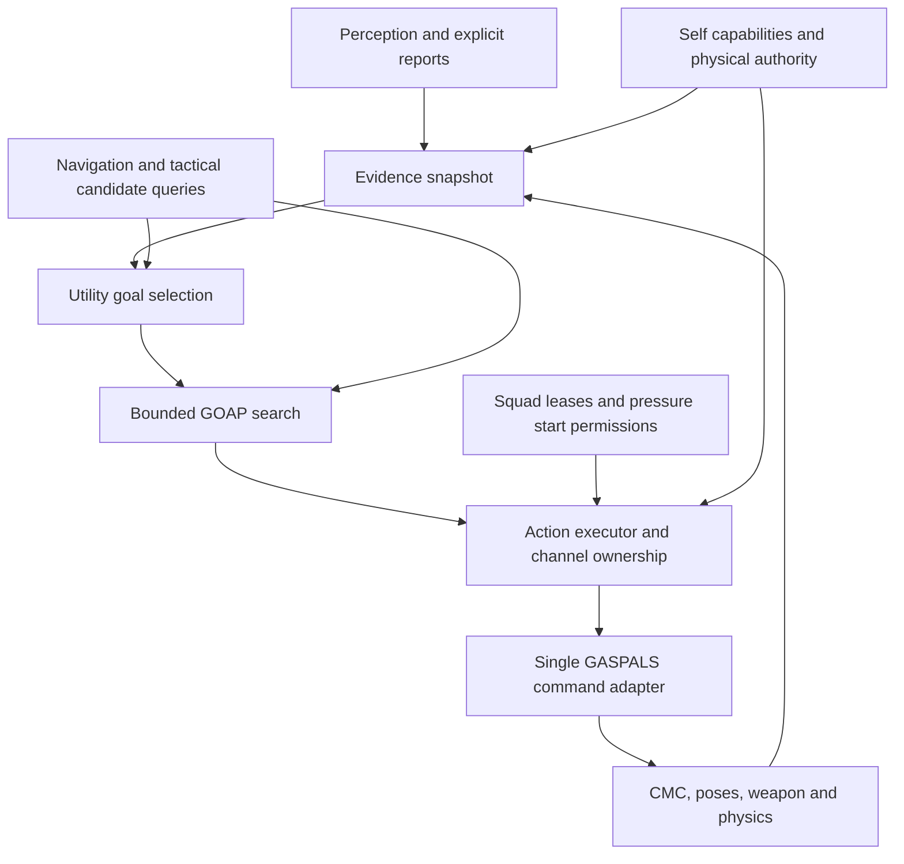

# UtilityGOAP01: replacement combat AI

Date: 2026-09-24. Status: selected architecture and proposed implementation contracts.
Authority: [exact owner direction](../Approvals/UtilityGOAP01-TaskCreation01.json).
Delivery: [plan](../Tasks/UtilityGOAP01Plan.md), [task index](../Tasks/UtilityGOAP01.md),
[source disposition](UtilityGOAP01SourceInventory.md).

## 1. Decision and product outcome

Utility AI selects the most useful attainable goal from the enemy's knowledge and
capabilities. GOAP constructs a bounded sequence of actions to satisfy that goal.
An executor owns actual movement, posture and weapon actions. GASPALS/CMC, physical
reaction and weapon systems retain authority over what the body can actually do.

The intended game remains an arcade shooter: initiative, persistent searching,
believable hearing, useful cover, moving fire/reload and understandable cooperation.
Surprise should come from alternate routes, timing and disrupted plans. Avoid
unrelenting pressure, unexplained knowledge and arbitrary hesitation. Architecture
alone does not demonstrate better gameplay; the owner judges concrete encounters.

Replace the current rule-based decision layer, including its intertwined cover and
mobile-fire policy. Retain proven primitives after extracting their policy side
effects. The first implementation removes obsolete active code. A short explicit
passive/manual intermediate is acceptable; UG-01 immediately follows UG-00 to
restore basic autonomous combat. There is no selectable old brain or old navigator.
Historical code remains in Git, without parallel production implementations.

No HTN, ACE, language model, external inference service or new paid dependency is
part of this plan. Start with a small project-owned C++ planner, pure where practical,
using existing engine services and tooling. This is a design choice, not a claim
that a generic planner library could never be useful.

## 2. Actual starting point

Baseline: commit `7ba267f`, [GASPALS correction Build07](../GASPALSAIFix01.md)
and its [primary review](../GASPALSAIFix01Review.md). This is canonical GASPALS/CMC;
the old Mover/custom balance enemy is not the target. Owner motion/combat-feel
acceptance remains separate from technical correction evidence.

`AdvanceCombat` currently coordinates rules, awareness, navigation, cover, weapon
actions and physical authority. `ChooseCover` both evaluates and commits movement,
pose and deadlines. `ObservePlayer` also starts reaction gates, while `Fire` reads
legacy assignment/cover phases. These are extraction boundaries, not reusable
controllers. The local home-grid A* is not the encounter navigation foundation.

Current one-member coordinator data is not delivered squad AI. Player health/death,
repeatable encounter lifecycle, destruction and powers remain external tasks.
Unknown player health is not full health, and physical presence of another fixture
is not a report of what that enemy knows. See the source disposition for exact files.

## 3. Ownership and data flow

Proposed module responsibilities (names are implementation proposals):

| Module | Owns | Must not own |
| --- | --- | --- |
| Knowledge | Valid observations, age, confidence, uncertain regions, encounter alert | Hidden target transforms or tactical commands |
| Capabilities | Self health, weapon/ammo, physical control, achieved stance | Speculative success of a future action |
| Tactical queries | Bounded reachable candidates, geometry checks, revisioned costs | Committing a path, pose or goal while scoring |
| Utility | Goal eligibility, scored considerations, commitment | Low-level movement or weapon calls |
| GOAP | Search over grounded action instances and predicted state | Live UObject reads, traces or gameplay writes per search node |
| Executor | Tokens, channels, start/update/abort/complete, observed effects | A second autonomous goal selector |
| Adapter | Sole delivery of resolved commands to the existing body/weapon seam | Tactical policy or an independently ticking path follower |
| Squad/pressure | Report delivery, role/space leases, start permissions | Shared omniscient target state |
| Diagnostics | Bounded explanations, timings, failures and replay inputs | A second task service or replacement benchmark framework |

The facade/component may be reused only as a thin ownership boundary. Its old fields,
timers, enums, fixture/debug consumers and autonomous call sites must be removed or
migrated. There must be one command writer across native and Blueprint consumers.

## 4. Knowledge and state contracts

- Build one authoritative decision snapshot from senses and self state. Facts have
  known/unknown state, value, evidence identity, source, world timestamp, confidence
  or uncertainty region, and encounter generation. Unknown never satisfies a
  positive or negative world fact unless the domain explicitly permits uncertainty.
- Sight may confirm a target location. Sound and incoming fire produce an estimated
  region/bearing with provenance. Duplicate/late stimuli cannot refresh themselves
  indefinitely, erase stronger fresh evidence, or repeatedly restart investigation.
- Persist encounter alert after confirmed contact, while aging the location evidence.
  Negative search observations update explored regions without erasing the alert.
  Idle/home does not silently replace a still-alert hunt when sight is lost.
- Separate observed state from planner predictions. A path request is not arrival;
  requested crouch/lean is not achieved pose; issuing fire is not damage or a kill.
  Reload completion must be reported by its actual action/weapon transaction.
- Snapshots and plans carry generation, relevant evidence, geometry and capability
  revisions. Revalidate affected predicates at dispatch and during execution.
  Unrelated snapshots need not abort a compatible plan. Late asynchronous results
  from an old generation are rejected without releasing someone else's resources.
- Give the planner quantized tactical facts and stable candidate IDs. Preserve exact
  geometry/weapon values in the execution adapter. Avoid unbounded real-valued
  branching or cross-products of every point, target, stance and squad role.

## 5. Utility goals

Start with `EngageContact`, `RestoreWeaponReadiness`, `InvestigateEvidence` and
`ObserveSafely`; add `ImprovePosition`, `ReduceExposure` and `SupportAssignment`
when their actual actions and evidence exist. Death, reset and loss of physical
authority bypass scoring through mandatory execution guards. A pending navigation
query is not proof that a goal is impossible.

Each goal provides: eligibility predicate, desired finite outcome, scored inputs,
commitment policy, feasibility status and explanation. Suggested considerations are
urgency, threat confidence/age, exposure, achievable weapon range, ammo, self health,
travel cost, recent failure and assigned support. Self health is available only from
the actual self-health seam; player health is unavailable unless legitimately known.

Normalize considerations to a documented range, initially 0..1. Separate hard
capability gates from preferences. A starting score model can be a weighted mean of
curves plus a bounded current-goal commitment bonus; tuning must show individual
terms and final score. A known impossible goal is ineligible. Unknown feasibility
can trigger one bounded query/plan attempt, not permanent exclusion.

Use minimum commitment and a score margin to avoid oscillation. Reevaluate promptly
on material evidence, capability, plan failure or geometry change; otherwise use a
budgeted periodic update. Urgent physical interruption always wins. Stable seeded
tie-breaking selects among near-equal feasible choices only. Variety cannot hide a
bad score or override weapon safety.

Utility determines which outcome matters; GOAP minimizes cost within that outcome.
Do not add raw Utility scores to action cost or invent a second goal policy inside
the planner. On `NoPlan`, record the reason and try the next eligible goal within
the same global request budget. Cache failures by relevant revisions with bounded
expiry; changed evidence can enable a previously impossible goal.

## 6. Bounded GOAP domain

Use finite forward search over grounded actions, initially uniform-cost/A* with a
zero heuristic. Require nonnegative comparable costs, deterministic ordering,
duplicate-state pruning and explicit limits for grounded candidates, nodes, depth,
memory and work per frame. A more informed heuristic needs evidence of admissibility
if optimality is claimed. We need a good bounded plan, not an unmeasured optimality
claim. Capture best valid plan and termination reason separately.

Define each action with parameters, preconditions, predicted effects, cost, required
channels, running validity, completion evidence, timeout and cancellation semantics.
Duration and exposure estimates are normalized into a shared documented cost scale.
Expensive LOS/path/cover queries happen once in a bounded query stage/cache; search
nodes operate on immutable results. `Pending`, `NoPath`, `NoPlan`, `BudgetExceeded`
and `StaleSnapshot` are distinct outcomes. Planner results are accepted only against
compatible current revisions; stale plans do not directly command actors.

| Initial or later action | Preconditions | Confirmed outcome / important limit |
| --- | --- | --- |
| MoveToCandidate | Reachable candidate and movement capability | Arrived within tolerance on a valid path; timeout/stuck is failure |
| AcquireAim | Current direct-fire evidence and weapon capability | Actual aim achieved; request weight alone is insufficient |
| DirectFireBurst | Current sight, aim, range, launch safety, ammo and start grant when applicable | Finite accepted launches; no predicted target damage/death |
| ReloadWeapon | Valid weapon/hands, ammo source and compatible ownership | Exactly one ammo transaction, or explicit cancellation outcome |
| ObserveRegion | Allowed evidence region and achievable observation pose | Bounded observation completed; no promise of target discovery |
| InspectRegion | Reachable evidence/search region | Observed search coverage updated; the target may be absent |
| TakeCover / SetPosture | Valid geometry and physical capability | Achieved protected pose; no invulnerability guarantee |
| SuppressRegion (UG-03) | Recent bounded region evidence and distinct authorization | Limited rounds/time; never covertly converts direct fire after sight loss |
| SupportRole (UG-06) | Valid participant report/lease and ready acknowledgements | Finite agreed contribution or abort; no assumed ally success |

Goals use finite progress markers such as `BurstCompleted`, `RegionInspected` or
`ReadyWeapon`, scoped to a goal instance. These are not perpetual claims of world
truth. Burst/observation loops must yield and reconsider; zero-cost/no-effect cycles
are rejected. `KillPlayer` and `AlwaysSeePlayer` are not guaranteed effects.

## 7. Execution, movement and interruption

GOAP initially plans a short sequential action chain. A declared action may own
compatible movement and weapon sub-actions concurrently; generic temporal planning
is unnecessary. Explicit moving burst/reload variants or a bounded executor
composition declare all resources and outcome semantics. Movement must not wait
for the first shot and reloading must not automatically stop valid locomotion.

Use exclusive owners for movement, weapon/hands and conflicting posture/lean;
observation can share only through defined compatibility. A single generation/action
token identifies each actual action. Replanning preserves a compatible running
reload, move or aim with its progress/deadlines; replacing a plan alone must not
restart reaction time, duplicate ammunition or destroy every active channel.

Each abort records reason, acknowledged resource release and whether the transaction
already committed. Revalidate both preconditions and achieved aim/muzzle corridor
at every launch. Falling, loss of control, death and reset cancel incompatible
commands before later action updates; recovery resumes from fresh capabilities.
Actual projectiles, recoil/cadence and physical hits remain in their existing systems.

Use world time for simulation deadlines, evidence age, reload and cooperation leases.
Current slowdown is world/bullets/rifle cadence 0.25 and hero movement 0.65. Wall-clock
time measures CPU work only. Full-stop integration arrives with MSQ-75; it must not
age knowledge or complete actions through paused simulation time.

## 8. Navigation and tactical space

Use UE Navigation System/NavMesh queries through a project adapter feeding the sole
CMC command route. UG-00 replaces the old local navigator with the interface and
safe no-route/manual behavior; UG-01 enables basic reachable-point movement, UG-02
delivers encounter topology, search coverage and bounded invalidation. Verify actual
nav coverage, agent dimensions, query completion and the installed UE API before
implementation. `NavigationSystem`/`AIModule` are not currently listed as project
dependencies; add only modules actually used. Do not keep a custom fallback graph.

Pathfinding, following, CMC obstacle response and tactical selection have distinct
owners. Do not run engine default movement and custom steering against one another.
Path length/time estimate and bounded exposure determine candidate cost; geometric
distance alone cannot select an unreachable shortcut. Track partial paths explicitly.
Dynamic query pending states need timeout/cancellation; unreachable regions are
temporarily excluded by relevant revision, without endless per-frame replanning.

Retain pure capsule, achieved-pose, source anatomy and muzzle geometry checks from
the latest CMC evidence. Rebuild their queries with explicit inputs and no policy
side effects. World collision/nav may be queried as environment geometry; unseen
target movement, health, abilities and tactical intent remain inaccessible.

## 9. Squad, pressure and later mechanics

UG-04 introduces two, then three enemies with explicit membership and knowledge
reports. A role lease can expose availability, not the hidden cause of its loss.
An unseen ally death cannot instantly become target-location intelligence. Reports
carry sender, evidence, age, confidence, delivery and expiry; no fixture scan creates
shared omniscience. Reserve firing lanes, cover slots and constrained destinations;
expire/release reservations after timeout, death, reset or acknowledged abort.

Group fire starts behind a conservative shared pressure gate from its first delivery.
UG-05 develops the complete pressure/cue policy. Privileged fairness inputs, if used,
return only grant/generic wait. They cannot enter knowledge, route, aim or Utility.
Compare hidden-position invariance before the gate, replay gate inputs separately,
and retain execution safety checks afterward. Denied attacks do useful permitted
observation/movement without an obvious standing queue. Cues reflect actual actions;
they are not guaranteed omniscient advance warning of all enemy intentions.

UG-06 adds cover-and-move, suppression with flank and interrupted-role recovery.
Contracts have participants, ready/commit acknowledgements, leases, finite phases,
timeouts and abort. The planner cannot assume cover fire is happening because an
ally was assigned. Direct fire and region suppression have distinct evidence rules,
with common actual muzzle/friendly safety. Lone enemies keep useful behavior.

Destruction integration is scheduled after UG-02, MSQ-71, initial UG-03 cover,
one-enemy MSQ-72 and an MSQ-74 specimen, before group work and extensive tuning.
MSQ-72 uses one enemy within its existing cap of three; UG-04 later adds group
combat after its safety foundation. Powers, disarming and wound
gestures have independent external prerequisites. They remove/add capabilities and
invalidate affected plans; they do not rebuild the brain. Smoke/traps are future
domain extensions after real mechanics and rules exist, not invented current actions
or blockers of this core program. Advanced dismemberment remains deferred.

## 10. Explainability, verification and completion

Extend the current bounded trace tooling with snapshot/generation, eligible goals,
score terms, selection/switch reason, grounded candidates, chosen plan/cost,
termination/budget counters, action resources/progress, observed effects and causal
failure/invalidation. A failed launch must explain actual geometry, not just `Aim`.
Stable seeds and recorded permitted inputs enable small deterministic replays.

Use meaningful pure-model checks for search correctness, partial knowledge and
resource transactions; affected native builds/integration checks for adapter changes;
focused gameplay scenarios for actual motion, aim, knowledge and group behavior.
The [task plan](../Tasks/UtilityGOAP01Plan.md) identifies stage-specific scenarios.
Do not assert a runtime criterion passed from source checks or historical evidence
against changed ownership. Declare verification authorization at each future dispatch;
existing owner-only gameplay boundaries and later narrow waivers stay task-scoped.

Measure one-enemy and three-enemy CPU percentiles/worst samples, query counts,
allocations, plan frequency, cancellation churn and bounded storage on the actual
machine. Set explicit budgets before enabling the relevant stage, with measured
baseline justification. Hard workload caps exist from UG-01; UG-13 profiles and tunes
the representative content. No claimed FPS, quality ranking or cost estimate is
already proven by this plan.

Core technical acceptance covers UG-00..07 and UG-13/14 with MSQ-71/72. Optional
integrations each close their own affected criteria. Full selected integrated scope
must name completed integration packages and applicable MSQ-78 evidence. Owner
motion, readability, surprise, difficulty and fun remain explicit separate verdicts.

## References

The project contracts above are our design. Primary background: Dave Mark and Kevin
Dill, [An Introduction to Utility Theory](https://www.gameaipro.com/GameAIPro/GameAIPro_Chapter09_An_Introduction_to_Utility_Theory.pdf)
for scoring choices; Jeff Orkin, [Three States and a Plan](https://www.gamedevs.org/uploads/three-states-plan-ai-of-fear.pdf)
for action preconditions/effects and planning in F.E.A.R.; Epic,
[UE Navigation System](https://dev.epicgames.com/documentation/en-us/unreal-engine/navigation-system-in-unreal-engine)
for native navigation capabilities. Checked 2026-09-24. These sources do not validate
our future implementation or its performance.
