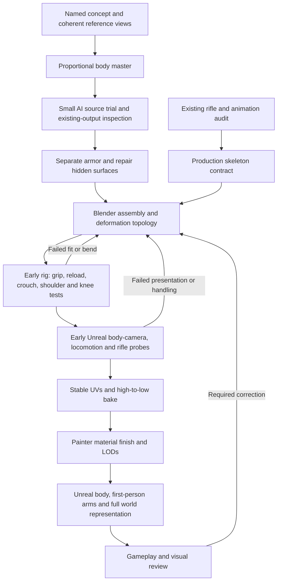

# PlayerCharacter01: AI-assisted character production pipeline

Research and planning revision: **2026-09-17 / Pipeline01**.

Latest capability study: the owner requested a detailed review of the MetaHuman
5.8 custom-character tutorial. [MetaHumanVideoStudy01](Research/PlayerCharacter01AI3D/MetaHumanVideoStudy01.md)
recommends testing From Custom Mesh on a preserved derivative before extensive
manual retopology. The installed Creator/Core Data and separate Markerless
motion-capture plugin are confirmed, but project loading and conversion are not.
This revises the presumed order of manual work; it does not replace the selected
Datum16 appearance or the exact MSQ52 rig contract. The existing body can be the
first test input; another generation is not yet justified. No production trial
or change of rig was executed by this research.

Latest source intake: the owner returned the generated whole-character coverall
FBX. [Datum16BodyIntake01](PlayerCharacter01BodyIntake01.md) records a usable
repair base with 24,974 polygons, a full clothed silhouette and five separated
digit forms per hand. Boot/ankle and collar topology defects, hand/joint flow,
dimensions and source-pose conversion remain before rigging. The source has no
UVs or skeleton. Original bytes are preserved; actual job/settings and the
intended input-to-output relationship remain unverified. No fitting, deformation
test or original-model round trip was performed. Full MSQ-54 remains incomplete.

Input delivery: the owner requested the whole-character coverall foundation
image. [Datum16UndersuitInput01](../Assets/Source/PlayerCharacter01/AI3D/Tripo/Datum16UndersuitInput01/README.md)
contains one front T-pose PNG without external armor, with gloves, boots and a
fully opaque soft under-helmet hood. The hidden cloth/hood construction is inferred;
the selected final helmet remains unchanged. The owner operated Tripo and returned
the source for the intake above. No fitted body or controller 3D generation
resulted from this art.

Earlier component intake: the owner operated the first component pilot and
returned its FBX. [Datum16ShoulderIntake01](PlayerCharacter01ShoulderIntake01.md)
records the completed local inspection: useful shell reference, with topology,
normal and inner-surface repair required before body fitting. Source bytes are
preserved; actual job settings and input identity remain unverified.
[Datum16ShoulderManual01](PlayerCharacter01TripoManualPilot01.md) supplies
one recommended single-image shoulder-cap input, settings and export instructions.
Its additional views are reference-only because projection/landmark consistency
was not established. The input preparation created no 3D source; the returned
owner export does not establish a fitted body master.
One common proportional body remains required for assembly; generating an entire
character with AI is optional. The full MSQ-54 prototype remains outstanding.

Subsequent owner decision on 2026-09-17: **Concept02 / Candidate01, 16 / Datum**
is selected and MSQ-52 execution is authorized. See the
[selection record](Approvals/PlayerCharacter01-Datum16Selection01.json).
Historical planning-only/pending-selection statements below remain evidence of
the research scope; the rig contract and reference reconciliation still precede
model production, and this instruction dispatches MSQ-52 only.

MSQ-52 subsequently completed its controller-verified audit and
`MSQ52-RigContract01`; use the [handoff](PlayerAnimationAudit01.md) for actual
skeleton, pose, source dimensions, clip coverage and reload-event constraints.
The proposed original-model export profile still needs an MSQ-54 round trip.

Task synchronization completed and verified on 2026-09-17: the
[Multica audit](Tasks/PlayerCharacter01AI3DTaskAudit01.md) applied this workflow
to the existing MSQ-50 and MSQ-52 through MSQ-60 descriptions, preserving the
delivered MSQ-51 and all statuses/assignments/dependencies/run histories. No new
issues or runs were created. Canonical editable sources use the existing task
root `Assets/Source/PlayerCharacter01/`.

The owner now has Tripo Studio and Meshy subscriptions and identified Tencent
Hunyuan3D Studio as a free additional tool. The owner requested a thorough
capability study, an explanation for a beginner and integration into our
protagonist workflow. This document is that integration. It does not record a
final character selection, a generated production asset or an executed Multica
modeling task.

Use the existing web allowances for scoped future work; the earlier blanket
exclusion of paid services no longer excludes these owner-purchased tools.
Subscription tiers were not supplied. No new subscriptions, top-ups, separately
billed APIs or local model installations are authorized by this planning update.
No credits were spent by the research. Owner-created jobs visible in the browser
were left untouched.

Detailed, dated feature evidence:

- [Tripo Studio](Research/PlayerCharacter01AI3D/TripoResearch01.md)
- [Meshy](Research/PlayerCharacter01AI3D/MeshyResearch01.md)
- [Hunyuan3D](Research/PlayerCharacter01AI3D/HunyuanResearch01.md)

These reports distinguish official documentation, controls observed in the live
web apps, and untested output behavior. A button's presence does not verify its
export, entitlement, quality or interoperability. No provider has won a
character-quality comparison in this research.

## Recommended production architecture

**One original character, one proportional master and one production skeleton;
separate editable armor and equipment; a unified Blender/Painter finish.**

Parts are useful when they correspond to construction and motion. Generating a
helmet, gloves, upper body and legs independently with no shared dimensions
creates mismatched necks, wrists, proportions and attachment surfaces. Start with
the whole character's proportions, then make or replace selected components
around that reference. A generated whole-body mesh can supply a useful volume or
detail source even if its final topology needs rebuilding.

Four routes are available, chosen per component:

1. Keep a generated component whose shape, topology and fit pass inspection.
2. Retopologize or rebuild over a useful generated high-detail source.
3. Model a simple or failed component directly in Blender from the approved art.
4. Fit standard MetaHuman topology/rig to a suitable original humanoid source,
   preserving its selected appearance and validating the garment surface and
   animation integration. This is a proposed option, not a proven conversion of
   the returned coverall. Keep source-pose bake output separate from final A-pose
   assembly, and preserve the existing contract until any alternative is verified.

The third route is particularly reasonable for crisp overlapping plates,
straps and small mechanical features. Repeated AI attempts are not automatically
cheaper than a controlled rebuild. Generated glove detail can be a reference,
but our first-person hands require deliberate joint topology and rifle contact.



## Which tool does what

This is a recommended division of work, not a ranking established by generated
asset tests. Use the tools as alternatives and selective utilities; a mesh does
not need to pass through all three services.

| Tool / mode | Useful contribution | Important constraint |
| --- | --- | --- |
| Tripo HD / eligible triangle source, Segment, Fill Parts | Whole-form source, semantic separation, boundary edits, completion of hidden areas | Segment currently excludes quad and rigged models. Split first, then remesh/rig. Completion invents hidden construction. |
| Tripo Smart Mesh P2.0 Preview | Native lighter triangle/quad candidate, up to four fixed input views | Specific P2 docs say up to 50K triangles or 25K quads. Native quads still need a bend/edge-flow check; do not assume subsequent Segment eligibility. |
| Meshy 7 High Detail | Detailed image or multiview source; alternative silhouette/shape result | Four image slots; Multi-View cannot be combined with Smart Topology in the documented web workflow. |
| Meshy T2 / Smart Topology | Lighter, natively separated mesh candidate from an image | Separate route from multiview. Native disconnected parts do not guarantee a usable undersuit or correct armor boundaries. |
| Hunyuan3D Studio V3.1 | Additional text/image shape source, 2-8 view input and component tools | Current hosted controls were observed directly; feature quotas and output compatibility still need a trial. The 86/day banner is explicitly temporary. |
| Blender | Shared proportions, clean geometry, attachment fit, topology, UVs, rig/weights, editable assembly and exports | This is where separate generated sources become one consistent character. Joining objects alone does not repair or rig them. |
| Substance Painter | Common metal/fabric/rubber/visor materials; baking, masks, wear scale, final maps | Final materials follow stable geometry/UVs. Service textures are optional references or sources, with provenance. |
| Unreal | Retargeting, locomotion, rifle actions, body/arm rendering, shadow, collisions and performance | A web animation preview cannot establish FPS gameplay readiness. |

The decisive constraints come from [Tripo Segment](https://studio.tripo3d.ai/workspace/segmentation),
[Tripo Smart Mesh](https://www.tripo3d.ai/features/smart-mesh),
[Meshy Multi-View](https://intercom.help/meshy/en/articles/12634481-how-to-use-multi-view),
[Meshy web changes](https://docs.meshy.ai/en/webapp/changelog) and the live
[Hunyuan geometry workspace](https://hy3d.tencent.ai/studio/creation/role/geo).
See the service reports for source conflicts and surface-specific limits.

## What to make as separate pieces

Datum 16 is the **planning example**, because it has a delivered T-pose package.
This does not select it over Chevron 25C. Never blend their different cuirass
designs by accident. Datum uses its polygonal breastplate and three abdominal
lames; 25C uses four overlapping angular cuirass plates. The selected design
must be identified before production modeling.

| Assembly group | Proposed approach | Fit and motion test |
| --- | --- | --- |
| Proportion body / flexible undersuit | One coherent original base, with connected deformation regions where needed. Generated volumes can guide it; rebuild weak joints. | Shoulder, elbow, crotch, hip, knee and ankle bend without tearing, collapsing or revealing missing surfaces. |
| Helmet shell, opaque visor, computer module | One fitted helmet assembly with separate material regions/objects as useful. A separate helmet AI trial is worthwhile. | Match head/neck size, keep the face concealed, preserve wearer-right computer placement and test head turns against collar/shoulders. |
| Breastplate/back protection and abdominal plates | Separate rigid shells over the same torso. Rebuild plate silhouettes and thickness if the generator melts or merges them. | Torso bend/twist, crouch and rifle shouldering preserve overlap without plates behaving like rubber. |
| Shoulder protection, left/right | Separate from sleeve and torso, with deliberate layered motion. | Arm elevation and cross-body reload reach; clearance must work throughout motion, not only in T-pose. |
| Forearm guards and elbow protection | Fit to original forearm and sleeve; keep elbow hinge clear. | Full elbow flexion, forearm twist, sleeve/guard/cuff continuity. |
| Hands/gloves, left/right | Original deformable topology, derived from the shared outfit. Generate detail only when useful. | Five articulated fingers per hand, isolated trigger finger, thumb opposition, open/closed grip, magazine contact and wrist continuity. |
| Belt, pouches, buckles and straps | Shared belt placement; separate hard accessories. Model simple repeated pieces once. | Hip bend, crouch, arm swing and weapon clearance. |
| Thigh, knee and shin protection | Fit left/right parts to the same legs; keep joint clearances. | Walk, crouch, planted turn and knee bend; no plate collision with belt or boot. |
| Boots | Separate editable sources fitted to ankles and soles; deformation only where needed. | Foot roll/toe motion as required by the rig, floor contact and cuff overlap. |

These are production groups, not a demand for nine independent paid generations
or a fixed number of runtime mesh components. Mirror genuinely symmetric shape
when useful, then restore designed asymmetry. Do not mirror text, computer
placement or directional details blindly.

Keep the source editable. At export, multiple disconnected surfaces can share
one skeleton; they need not be welded into one watertight shell. Unreal supports
skeletal assets made from multiple meshes bound to the same skeleton.
[Epic's skeletal-mesh pipeline](https://dev.epicgames.com/documentation/en-us/unreal-engine/fbx-skeletal-mesh-pipeline-in-unreal-engine)
does not imply that many separate runtime components or material slots are free.
Keep runtime component/material counts deliberate and measure their cost.

## Step-by-step production sequence

### 1. Freeze design and reconcile reference images

Use the owner-selected package and variant. Record source filenames/hashes and
which image is authoritative if details disagree. The existing
[Datum T-pose manifest](../Assets/Concepts/PlayerCharacter01/Datum16MultiViewTpose01/manifest.json)
explicitly says cross-view 3D consistency is unverified. Its eight illustrations
are not calibrated photographs of an existing object.

Check height in frame, shoulder/hip width, helmet shape, plate count, belt height,
limb length, boot shape and asymmetry across front/back/profiles. Use one
neutral pose across the set. If views disagree, correct a derived input package
or use fewer reliable views. Do not feed contradictions to a multiview model and
expect more images to repair them. Preserve all original art bytes.

| Surface | Reference input plan |
| --- | --- |
| Tripo P2 multiview | Up to four fixed views: Front, Left, Right, Back. |
| Meshy 7 web multiview | Main/Front plus Left, Back, Right, up to four total. |
| Hunyuan hosted V3.1 geometry | UI shows minimum two, maximum eight: required Front, then Back, Left, Right, Top, Bottom, Left 45 degrees, Right 45 degrees. |
| Single-image / Smart Topology trial | One isolated coherent figure or one carefully prepared isolated component. |

Our Datum filenames use screen-facing Left/Right conventions. Map images by the
service's visual examples and actual visible side; filenames alone do not prove
correct assignment. Keep Top/Bottom only when projection and pose are useful;
eight supported slots are not an instruction to fill all of them. Do not upload
a contact sheet as one image expecting it to behave like separate multiview
inputs. For isolated components show the complete desired object, not an
accidental crop containing torso, severed anatomy or a ground plane.

Keep the owner-corrected T-pose as a source. A service may prefer or normalize
to A-pose; any such derived result needs a design/proportion check. Align the
eventual bind/retarget pose in Blender to the production rig contract.

### 2. Inspect existing experiments before spending again

The live workspaces contain owner-created helmet experiments. Inventory and
inspect suitable existing exports first in a future execution task. Record
which references and settings they used; visually similar thumbnails do not
establish a fair comparison or a selected production result.

Then run the smallest missing experiment: one common helmet reference and, if
necessary, one whole-character proportional source. Compare providers only on
the same task and inputs, allowing for different supported modes. Keep the
whole-body and component trials distinguishable. Do not generate every component
in all three tools.

Start with geometry-only when available. Judge a gray untextured mesh with
wireframe and consistent front/back/side views. Record silhouette fidelity,
plate separation, missing or fused surfaces, mesh density, import integrity and
estimated repair work. Texture can hide a poor form. The best provider is the
one that produces the best usable result for the combined credits and repair
effort; no universal winner is assumed.

Suggested bounded pilot: reuse existing outputs, at most one new geometry
candidate per selected provider, and one targeted rerun only when a specific
input/setting correction explains why it may improve. Two equivalent failures
trigger a changed method, provider or Blender rebuild. This is a proposed trial
cap, not an automatically authorized credit charge.

### 3. Establish dimensions and the production skeleton contract

Before fitting many pieces, define character height, camera/eye height, shoulder
width, limb lengths, wrist/ankle/neck attachment regions and weapon grip points.
These values remain to be chosen from the selected design and gameplay; this
study does not invent an approved height.

MSQ-52 audits the existing rifle/FP/TP animations and actual skeleton. Preserve
the source pack at `D:/devgames/Weapon`. Determine deform bones, finger chains,
twist support, root orientation, scale, bind pose, IK targets and retarget
requirements. A vendor's Mixamo or generic humanoid naming does not establish
compatibility with our weapon pack. Reuse motion and a compatible rig contract
where useful; the visible model remains original.

### 4. Separate, complete and assemble in Blender

For Tripo, preserve an eligible unrigged triangle source, segment it, correct
boundaries, selectively complete missing surfaces, and only then consider quad
retopology or rigging. A direct P2 quad result can instead go to Blender for
separation. For Meshy, choose either the multiview HD source or the T2 multipart
source, with print cutting kept separate. Hunyuan component splitting is another
candidate; verify boundaries on an actual export before committing.

Import each untouched export into a source/reference collection. Build the
working assembly at consistent scale/origin/axes around the body master. Name
parts by anatomy/function. Correct normals, duplicates, holes and visible
intersections. Keep intentional garment openings; avoid print-style caps across
a cuff or neck unless a real design surface belongs there.

Give armor plausible thickness and hidden attachment surfaces, but do not build
unnecessary inner anatomy. A correctly fitted hard plate generally follows an
appropriate rigid transform or controlled armor motion, while flexible fabric
uses smoothly blended weights. Shoulder and layered abdominal armor may need
additional controlled motion; assigning every plate wholly to the nearest bone
is not a universal solution.

### 5. Retopology and an early deformation prototype

Retopology means arranging the final mesh so it can bend and hold its shape.
Decimation only reduces faces; automatic quad output does not guarantee useful
joint loops. Preserve generated detail sources and replace topology where it
fails. Prioritize fingers, wrists, elbows, shoulders, hips and knees.
[Blender's remeshing guidance](https://docs.blender.org/manual/en/5.0/modeling/meshes/retopology.html)
explains why automatic remeshing and animation topology are different tasks.

Bind the working mesh to the agreed rig and correct weights. Test neutral stance,
arms up, cross-body reach, elbow bend, forearm twist, rifle aim, open/closed hand,
trigger finger, magazine reach, torso twist, crouch, knee bend and foot roll.
Inspect first-person hand distance as well as observer views. Any failed joint
or plate fit returns to assembly/topology before finishing textures.

Service auto-rigging is optional diagnostic scaffolding. It can reveal gross
problems quickly, but it does not replace the production skeleton, weight
editing or rifle animation integration. Never rig each generated part separately
and try to combine independent skeletons afterward.

Before final finish, take the original rigged prototype into Unreal for the
MSQ-55/56/57 presentation and gameplay probes: look-down body/arm continuity,
camera clearance, full world shadow, directional movement, planted turns,
rifle grip, aim and reload timing. Use provisional materials. Correct the
source if these probes expose proportion, topology or pose problems. Passing
Blender poses alone does not clear MSQ-58's existing prerequisites.

### 6. Stable UVs, bakes and material finish

UVs are a flat layout of the model's surfaces for painting. Once shape and
deformation topology are stable, establish seams, scale and consistent texel
density. Allocate detail according to visibility, especially first-person hands
and forearms. Avoid one large texture per small armor plate.

Baking transfers useful high-detail surface information to maps for the lighter
mesh. Preserve the approved silhouette in geometry; a normal map cannot repair
wrong silhouette or articulation. Use controlled cages/part matching to prevent
neighboring plates from contaminating each other's bakes. Keep triangulation
and tangent conventions consistent through baking and export.

Build coherent metal, fabric, rubber and opaque-visor materials in Painter,
retaining useful generated maps only after inspection. Service-specific lighting,
wear scale and color differences must not make the assembly look like unrelated
assets. Verify actual Base Color, Roughness, Metallic and Normal outputs; the
documented Meshy multiview texture release is base-color-only. An 8K image does
not imply PBR or good material separation.

Start material previews at 2K or 4K as appropriate; increase only for an observed
close-view problem. Final triangle, texture, material-slot and LOD budgets are
set after the prototype and measured in Unreal, not taken from an AI slider.
Store native `.blend` and `.spp` sources and reproducible export settings.

### 7. Final export and Unreal integration

Prefer GLB for a compact textured triangle reference. Use OBJ/FBX when retaining
quad topology for editing, with texture dependencies saved alongside. Use an
inspected rigged FBX/GLB for an auto-rig experiment and the validated Blender
source for the final Unreal skeletal export. STL loses the material/rig workflow
and is not our character interchange format. Check actual file contents, not
only the extension.

Avoid sending the completed rigged, multi-material Blender character through
another generator as an ordinary round trip: upload tools may merge objects,
strip rigs, re-unwrap or replace materials. Use disposable scoped copies if a
specific external texture operation is useful.

Derive the world body, camera-visible torso/legs and first-person arms from the
same original model. Maintain a complete head/body/weapon world representation
for shadows/reflections and appropriate observer presentation. First-person
rendering can use separate FOV/projection behavior; verify the arm/body seam and
avoid doubled arms, head interiors and disconnected shadows. See
[Epic's first-person rendering guide](https://dev.epicgames.com/documentation/en-us/unreal-engine/first-person-rendering).

The service animation libraries do not implement our directional movement,
planted turn steps, foot IK, rifle aim/fire/reload synchronization, camera or
wall-proximity behavior. Their first implementation/probes occur on the rigged
prototype in step 5, before final finish. Recheck the finished candidate against
those working behaviors. Validate actual PIE interaction and the final
source/export identity before owner playtest.

## Mapping into the existing Multica task family

| Existing task | Pipeline addition |
| --- | --- |
| MSQ-51 / MSQ-53 | Preserve all art; identify one owner-selected design and reconcile the production reference views. Owner-only concept evaluation remains. |
| MSQ-52 | Audit the rifle/animation skeleton and lock the rig/scale/pose contract before fitting final parts. |
| MSQ-54 | Add bounded AI-source trial and provenance, common body reference, component assembly, topology repair and early hand/armor deformation tests. |
| MSQ-55 | Derive coherent first-person arms, visible body and complete world representation from that source. |
| MSQ-56 / MSQ-57 | Keep locomotion and weapon gameplay tests on the original rigged body; vendor preset motions do not replace these deliverables. |
| MSQ-58 | Finish topology/UVs/bakes/Painter materials, weights and LODs after successful MSQ-54/55/56/57 deformation, presentation and gameplay probes. |
| MSQ-59 / MSQ-60 | Inspect final integrated identity, provenance, visual quality, deformation, gameplay, performance and required corrections. |

This is a planning addendum linked from the existing plan and task index.
Multica remains the task-state source of truth. No issue status, assignment,
profile, native argument or run was changed by this research. Future production
continues through Multica with one writer per DCC/editor and one heavy workload
at a time. No concept review agent was dispatched by this research.

## Handoff, budgets and provenance

Recommended future organization within the existing project:

```text
Assets/Source/PlayerCharacter01/AI3D/<Provider>/<Candidate>/
  inputs-manifest.json, settings.json, provenance.json, original export
Assets/Source/PlayerCharacter01/
  editable Blender and Painter sources
Saved/PlayerCharacter01/AI3DPilot01/
  temporary imports, diagnostics, comparison views and full logs
```

These paths retain the existing character-task source root; no character assets
were generated by this research. Reuse existing registry identities when a
production task starts. If separately authorized Meshy API work is used later,
its installed skill requires `meshy_output/<dated-task>/` for downloads;
register that source and promote only selected artifacts deliberately. The web
workflow is not dependent on that API-only helper.

For each accepted source record provider/surface, model/version, task ID,
timestamp, input hashes, prompt/settings, actual credit/quota use, paid/free
generation status, effective license source, visibility, export formats,
topology/UV/map contents, dimensions and SHA-256. Exclude credentials, signed
download tokens, account identifiers and billing details from tracked files.
Use the [asset registry](AssetRegistry.md) for actual source/derivative links;
registration does not grant visual acceptance.

Tripo Studio explicitly separates Studio and API credit balances. Meshy's
documentation has different web/API schedules and ambiguous entitlement wording;
do not infer a new paid API allowance. Use the existing web interfaces for the
first trial. Manual export works without an API or bridge installation.
Hunyuan's hosted UI, Tencent Cloud API and downloadable models have different
capabilities and legal terms; keep them separate. In particular, do not apply an
open-model license to a hosted output. The hosted-output commercial-use evidence
remains a specific unresolved item in the Hunyuan report.

Check current quotes/quotas and the effective terms at actual use. Do not assume
old free outputs acquire paid/private rights retrospectively. Retain current
private settings on the paid tools. No publication to a community is part of
this pipeline. This is provenance management, not a promise of copyright
exclusivity or a new legal approval workflow.

Measure current project disk usage before downloads/imports. Keep total sources,
exports, caches, history and services within the existing **250 GB** cap. Avoid
downloading every format or every failed textured variant. Preserve source
identities and selected comparison evidence; never delete owner assets to make
room. Git stores project decisions/code/config/source; binary assets use LFS;
large generated diagnostics belong under `Saved/`.

## First useful deliverable and remaining choices

The next proposed production deliverable is an identified **untextured fitted
body-and-armor prototype**, with a working hand/forearm/rifle test and preserved
sources. A beautiful static helmet or an automatic walk cycle alone does not
complete that deliverable.

Before an execution dispatch, identify the exact design, the purchased web
tiers/available quotas, existing useful model exports and the MSQ-52 rig contract.
The old named concept-selection requirement remains because the current owner
message requests a workflow but does not choose a design. This requirement is
recorded in [the task index](Tasks/PlayerCharacter01Tasks.md); it did not prevent
completion of this research and planning update.

Practical validation still outstanding: provider quality on our inputs, exported
part hierarchy/UV/PBR integrity, skeleton/finger contents, repair effort,
Blender/Unreal round trip, final dimensions and measured runtime budgets. The
research explains how to resolve them without claiming they have already passed.
