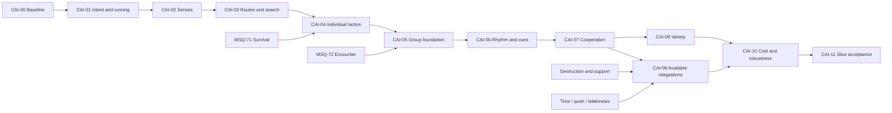

# CombatAI01 implementation plan

Later refinement after MSQ-103 owner play: [situational tactics and coordinator](../Design/CombatAI01TacticalCoordinator01.md).
The later [owner start](../Approvals/CombatAI01-Tactical01-OwnerStart01.json)
authorizes [MSQ-118 / CAI-T01](CombatAI01/CAI-T01.md), a bounded sight-based early
tactical slice on MSQ-103. Full hearing, topology, individual/squad packages retain
their remaining scope and existing acceptance prerequisites.

Prepared 2026-09-23 for the owner's request for a very detailed plan for surprising,
high-quality arcade shooter AI. Parent context: MSQ-67; starting delivery: MSQ-70.
Original status: tasks prepared in Multica. CAI-00/01 and the later early CAI-T01
slice are now delivered for owner testing; see the current task index.
The later [task-creation request](../Approvals/CombatAI01-TaskCreation01.json)
formalized this plan as parent **MSQ-101** and children **MSQ-102 through MSQ-117**.
See the [task index](CombatAI01.md) and [setup verification](../CombatAI01TaskSetup01.md).

Read [ProjectState](../ProjectState.md), the [owner request](../Approvals/CombatAI01-Planning01.json)
and [CombatAI01 design and architecture](../Design/CombatAI01.md). The design document
defines system contracts; this document defines order, work, acceptance and delivery.

## 1. Deliveries and success criteria

| Delivery | Included packages | What the owner can experience |
| --- | --- | --- |
| A: persistent hunter | CAI-00 through CAI-03 | One enemy runs, reacts to footsteps/incoming fire and continues a meaningful search |
| B: capable individual | CAI-04 | One enemy chooses useful positions, changes approach and exposes understandable opportunities |
| C: surprising small squad | CAI-05 through CAI-07 | Up to three enemies share imperfect information, coordinate, change angles and allow counterplay |
| D: replay variety | CAI-08 | Distinct choices and observed-habit responses without perfect knowledge or automatic counters |
| E: physical combat integration | CAI-09A through CAI-09D as prerequisites become available | Destruction, injuries and powers change enemy plans coherently |
| F: accepted representative slice | CAI-10 and CAI-11 | Measured cost, resolved blockers, owner-tested surprise/readability and repeatable lifecycle |

Each delivery must be playable before the next layer is treated as complete. A and B
are useful independently of future powers, grenades, new characters or a large squad.
Formal lethality and loss/restart acceptance requires MSQ-71. Complete encounter
win/loss/reset uses MSQ-72. Until those exist, hit counters support mechanics inspection
but cannot prove survival balance.

Evaluate quality through observed choices, understandable causes, player response
opportunities, physical consistency and replay interest. Neither increased damage nor
the number of implemented actions establishes superior AI. Comparison with F.E.A.R.
remains an owner-facing aspiration until comparable gameplay evidence exists.

## 2. Scheduling and relationship to the existing backlog

CAI identifiers below are package references mapped to real issues in the
[MSQ-101 task index](CombatAI01.md). Multica remains the source of live status.
All 16 implementation tasks were prepared in backlog, unassigned and without runs.
CAI-09D is split into MSQ-114 disarming and MSQ-115 wound-action integration so its
independent mechanics do not block each other. Conditional future integrations are
unstaged; core native stages preserve a sequence without waiting for all future
abilities. Metadata describes prerequisites; it is not an automatic dispatcher.

Recommended order for the next implementation work:

The later [owner priority decision](../Approvals/CombatPriorities01-OwnerScope01.json)
prioritizes AI, shooting and environmental destruction, deferring MSQ-73
dismemberment. A bounded MSQ-74 sample after delivery A and MSQ-71/72, before
extensive cover/squad tuning, is the recommended early destruction slot. It can
inform CAI-04 tuning; its exact placement is not a new hard AI dependency or
execution instruction. MSQ-111 still requires MSQ-109 and MSQ-74.

1. CAI-00 -> CAI-01 -> CAI-02 -> CAI-03: deliver A on the current single opponent.
2. MSQ-71 player survival, then CAI-04: complete meaningful survival/balance judgement
   for B. CAI-04 position mechanics can be developed earlier using hit counters.
3. MSQ-72 encounter lifecycle and removable placements, then CAI-05 -> CAI-06 ->
   CAI-07: deliver the coordinated three-enemy C. The new squad policy must have its
   own scope; MSQ-72's original brief expressly excluded a squad framework.
4. CAI-08: refine variety after C is already enjoyable and understandable.
5. Existing MSQ-74 through MSQ-77 and applicable support tasks supply real mechanics.
   Integrate each available seam in the corresponding CAI-09 package; do not block
   deliveries A-D on unavailable abilities or art. Environmental destruction has
   the recommended earlier slot above; MSQ-73 is a deferred expansion after the
   priority combat work and cannot block this program or initial integrated acceptance.
6. CAI-10 measures the completed target population; CAI-11 consolidates the accepted
   slice with MSQ-78 integration rather than duplicating its full acceptance suite.

Detailed interleaving remains a proposal; the owner's dismemberment deferral and
removal of the MSQ-73 -> MSQ-74 dependency are current scheduling authority.
MSQ-93 through MSQ-96, MSQ-99/100 and episode/art work retain
their own scope and owner decisions.

CAI-10 may profile A-D before CAI-09 mechanics exist. Delivery C does not wait for
the entire diagram. The arrows from MSQ-71/72 denote full acceptance prerequisites;
safe source preparation or instrumented mechanics work need not wait for health.

## 3. Execution, evidence and ownership

- One production writer, one Unreal writer and one memory-heavy workload at a time.
  Bounded independent advisory/review reads may run concurrently.
- Multica is the default route for new implementation tasks. The earlier direct,
  outside-Multica MSQ-70 exception is task-scoped; use it only for an explicitly
  continuing authorized correction, not as a blanket program exception.
- All executors/reviewers use max reasoning and standard speed. Verify native run
  settings as well as configured profiles; restore other task settings afterward.
- For substantive implementation, the executor implements/self-checks and one primary
  independent reviewer owns technical review. Controller acceptance covers scope,
  candidate identity, evidence applicability and finding closure. Owner judges play.
- Current MSQ-70 delivery reserved gameplay testing for the owner. A continuing
  correction keeps build/source checks and owner gameplay. New package dispatches
  must state their applicable verification scope; this plan does not silently replace
  the existing reservation with automated gameplay execution.
- Each runtime criterion below is a planned check, never a claim of completed work.
  When owner-only testing applies, provide exact controls and a short observation
  sheet, mark runtime criteria pending, and record actual owner feedback accurately.
- Use existing probes, console/status tools and evidence conventions. Add only the
  tests needed for new invariants/risks. No full animation sweep, per-style matrix or
  repeated passing benchmark without a recorded reason.
- Commit verified task-scoped work locally before handoff with its real task ID.
  Keep generated data under `Saved/CombatAI01/<package>/<candidate>/`, outside Git.

Every implementation handoff contains: scope, changed files/assets, candidate identity,
chosen tuning, build result, focused evidence, review findings/closure, owner route,
known limitations and next eligible package. Immutable earlier manifests are preserved.

## 4. CAI-00: baseline, contracts and observability

**Purpose:** make every later decision diagnosable and establish what the current
one-enemy implementation actually does. Size/risk: small scope, low code risk.
Prerequisite: current MSQ-70 source/build identity and authorized execution route.

Work:

1. Record repository state, owner edits, current DLL/candidate, engine version, map,
   active test mode and permitted test scope. Check live editor state before mutations.
2. Inventory the exact movement, rifle, damage, projectile and reset interfaces.
   Document the single input writer and current physical authority precedence.
3. Extend existing status output with encounter generation, alert/evidence, current
   intent, physical authority, path outcome and a bounded decision/event ring.
4. Record current build-only limitations: no demonstrated run gait, hearing, persistent
   search, group lanes or multi-enemy performance. Mark facts separately from hypotheses.
5. Define the input/event snapshot used by later pure decision tests; keep privileged
   fairness inputs in a separate trace channel. Introduce stable
   per-agent seeds derived from encounter seed and stable spawn index, not identical
   `Spread.Initialize(70)` for every enemy.
6. Inventory reusable player-facing audio cues. Debug text is sufficient for diagnosis
   but cannot close the final audibility/readability criterion.

Outputs: short baseline report, proposed data contracts, bounded status trace, declared
test configuration and recorded seeds. No scene redesign or AI framework migration.

Acceptance: same seed/event stream reproduces decision-level input capture; F6 clears
the ring/generation without changing unrelated player-ammo behavior; no credentials or
unbounded per-frame logs; source/build checks identify the actual candidate. If runtime
is authorized, collect one representative baseline cost sample, not a benchmark suite.

Owner route: run current one-enemy mode, break sight, receive/inflict a hit and restart.
Use existing feedback to identify the observed failure path; do not ask the owner to
prove every source assertion manually.

## 5. CAI-01: persistent intent and running vertical slice

**Purpose:** deliver the earliest visible improvement while preparing safe action
execution. Size/risk: medium, movement/physical boundary. Depends on CAI-00.

Work:

1. Add separate encounter alert and last-observation fields; remove the policy coupling
   between a failed action, `StartReturn`, memory erasure and `IgnoreSightUntil`.
2. Keep fresh perception running during tactical cooldowns. Cooldowns suppress only
   the failed action/destination, never all new observations.
3. Add a minimal action lifecycle around the existing move/aim/burst/reload commands:
   start, update, success, cancel and failure reason with action/generation IDs.
4. Select walk/run explicitly by purpose. Verify the imported GASP gait mapping.
   Direction magnitude is normalized by the existing setter; it is not a speed input.
5. Validate running, braking into aim and return from physical recovery using existing
   assets. Retain the current stationary launch gate until moving fire has its own proof.
6. Implement a bounded preliminary search using last-seen area and reachable local
   alternatives. It remains alert after all existing 4/12-second disengagement limits.
   CAI-03 later replaces the limited spatial search with encounter topology.
7. Cancel requests on physics/death/reset; retain evidence through living recovery;
   reject stale callbacks and replan from actual feet when movement authority returns.

Acceptance: S01, S06, S07, S10 in the scenario catalogue. No stale movement/fire after
authority changes; a failed path leaves the enemy alert; actual running is visible
when movement is feasible. Do not claim Recast routes or multi-room search yet.

Fallback: if the gait request exposes a bridge defect, correct that bounded bridge
without replacing the locomotion system. If no alternate local route exists, the
enemy visibly observes a useful reachable sector and retries on new evidence.

Owner route: provoke pursuit over a clear distance, disappear behind retained cover,
wait beyond the old timeout, relocate, hit the enemy and observe re-entry into search.

## 6. CAI-02: footsteps, fire and evidence memory

**Purpose:** give the hunter multiple honest sources of information.
Size/risk: medium/high because movement audio and projectile clocks meet here.
Depends on CAI-01. Near-miss sensing can be completed in CAI-04 if not yet needed.

Work:

1. Add the normalized immutable stimulus record and per-enemy hypothesis memory.
   Separate attribution/lifecycle actor handles from permitted targeting information.
2. Route current sight through the same memory path. Add bounded retention/hysteresis
   and body samples where needed without allowing obstructed shots.
3. Audit existing player step audio/contact events. Choose one authoritative event
   producer, or a grounded-distance fallback, and prevent dual emissions.
4. Add walk/run intensity, actual-ground-travel gating and one landing event. Provide
   distance/occlusion attenuation and uncertain localization; document acoustic limits.
5. Emit accepted-shot noise from `LaunchTimed`'s accepted branch. Emit impact/damage
   evidence at resolved contact and before physical interruption discards tactical intent.
6. Preserve projectile simulation/contact time and world receipt/occurrence time as
   distinct fields until a tested conversion exists. Never substitute real-time impact
   presentation timestamps for AI reaction deadlines.
7. Queue delivery outside projectile collision iteration. Preserve ordered contact and
   reset-generation protection; deduplicate shot/listener and hit events.
8. Add category/team filtering, event merging, bounded listeners and debug regions.
   A heard source actor does not automatically reveal identity or current location.
9. Inspect engine AI Perception only as an optional sensor/event transport adapter.
   Use one authoritative hearing route and retain project memory/uncertainty contracts.

Acceptance: S02-S05 plus affected S06/S10/S11. Identical unseen positions cannot change
memory absent new evidence. Incoming damage supplies a bearing, not a live exact target.
Footstep cadence agrees with actual motion; muted audio does not disable gameplay hearing.

Fallback: first ship a declared distance/occlusion model for the current open lobby.
Doorway-aware propagation is a later extension if representative geometry needs it.
Do not invent rooms/portals or advertise physically accurate sound.

Owner route: hide from sight, walk then run, stop, jump/land, fire from a new angle and
relocate quietly. Observe how the enemy searches the old sound/shot region.

## 7. CAI-03: encounter navigation and useful persistent search

**Purpose:** give search real spatial alternatives and remove the home-grid limitation.
Size/risk: large integration risk; keep its scope to routes/search. Depends on CAI-02.

Work:

1. Add a navigation adapter with Pending/Complete/Partial/Invalid/Unreachable outcomes,
   request generation, geometry revision and explicit cancel/replacement behavior.
2. Use Recast queries with actual agent capsule properties, bounded ground projection,
   supported slope/step envelope and removable nav setup. Keep GASP as movement owner.
3. Prove a direct path and a route around existing retained geometry. Smooth/look ahead
   within verified traversability; never shortcut through a wall or unsupported edge.
4. Retain local collision/support validation while following a cached route. A partial
   path is useful to a boundary but is not successful arrival at the requested target.
5. Derive a small connected set of search sectors and plausible exits from current
   navigation and occlusion. Add removable annotations only where geometry is ambiguous.
6. Track checked visible areas, rejected/unreachable destinations and observation age.
   Prioritize information gain and avoid repeatedly clearing the same empty location.
7. Allow a new clue to redirect the search with a controlled replan. Replace hard pursuit
   expiry with action failure/backoff and a useful new search/observation decision.
8. Establish global nav work quotas, outstanding-request limits and stale-result checks.
   Verify bounded behavior with an unreachable goal and a moved/invalidated obstacle.

Acceptance: S01-S03, S07, S08 and affected S06/S10. Persistent search lasts at least
60 world seconds in the scoped scenario without returning unaware or growing queues.
The test is a bounded sample of an invariant, not proof of literally infinite execution.

Fallback: preserve the previous navigator behind an explicit debug switch until the
new adapter passes. Do not silently change to unlimited per-enemy searches. If Recast
cannot support a required route, diagnose projection/collision/support before trying
NavMover/standard path following; never run both followers simultaneously.

Delivery A closure: running, hearing, incoming-fire awareness and persistent search
have a named candidate and honest evidence status. The owner can evaluate one hunter.

## 8. CAI-04: individual tactics, cover and firing rhythm

**Purpose:** turn movement competence into interesting combat choices.
Size/risk: large behavior/feel scope. Depends on A; MSQ-71 for survival balance acceptance.

Work:

1. Add the action eligibility/utility selector and inspectable score terms, commitment,
   switching margin, recent-action penalty and deterministic bounded tie variation.
2. Define the initial action set from the design document. Use stable action outcomes
   rather than adding another switch branch for every combination of conditions.
3. Add a small set of removable tactical anchors on existing geometry. Validate stance,
   capsule clearance, cover direction, muzzle corridor, exposure and approach/exit.
4. Implement repositioning to a genuinely different useful angle and withdrawing to
   another active position when the current one is compromised.
5. Improve aim reacquisition/turn limits, burst decisions and magazine-aware action
   choice. Split `DirectFire` and `SuppressRegion` aim-source/authorization contracts:
   direct shots retain fresh sight; suppression uses an evidence-backed bounded region,
   original age, finite round budget and expiry without a live target-position read.
   Both retain common weapon/authority/geometry safety and the finite-flight launch path.
6. Add a bounded suppression action with independent eligibility/commitment; loss of
   sight does not silently convert an unfinished direct burst. Add near-miss evidence
   only where needed, sampling actual traveled segments up to earliest impact with
   deduplication and no repeated frozen-bullet stimuli.
7. Model reload as a vulnerable real action; use cover when available. Keep gameplay
   ammo transfer separate from animation completion and retain interruption policy.
8. Make failure recovery specific: blocked muzzle -> reposition candidate; stale target
   -> search; no cover -> use a valid exposed action with a documented risk score.

Acceptance: S04/S05, S08/S09, S12 and S23. At least two materially different valid responses
are possible when the scenario actually offers two useful positions. No utility
oscillation, indefinite aim wait, precision fire during unsupported movement or
continuous suppression that follows the unseen player.

Owner route: fight one enemy from two different positions, repeat a visible peek, break
contact and attack while it changes position/reloads. Judge whether those choices
create readable opportunities rather than forcing prolonged passive play.

Delivery B closes on competent decisions and owner feedback; initial tuning is not
locked for the whole game. Do not multiply health/damage to disguise weak choices.

## 9. CAI-05: safe multi-enemy foundation and shared information

**Purpose:** introduce two/three combatants with correct space, knowledge and lifecycle.
Size/risk: high concurrency and collision risk. Depends on B and MSQ-72 lifecycle.

Work:

1. Generalize explicit one/two/three-enemy encounter configuration with stable IDs and
   per-agent seeds. Retain passive fixtures as a separate test mode.
2. Add encounter/squad coordinator records, membership and idempotent register/remove.
   Death, reset and mode changes must release all memberships/reservations.
3. Add target reports carrying original uncertainty, observation time and delayed
   delivery. Share friendly status without sharing a hidden target transform.
4. Introduce tactical position, narrow-passage and firing-lane reservations with leases,
   expiry and generation checks. Useful local yielding replaces collision disabling.
5. Add friendly physical/proxy occupancy checks independent of projectile `BuildQuery`.
   Recheck friendly risk at launch; an unsafe lane defers fire or changes position.
6. Introduce the minimum pressure permission seam now: conservative new-shooter and
   maneuver limits. Group competence must not precede all pressure safeguards.
7. Cover membership change during recovery, death, late report delivery and F6. Record
   current friendly-fire policy explicitly and preserve the shared damage path.

Acceptance: S10, S13, S14 and initial S15. Two enemies do not share a reserved pose,
lock one another indefinitely or shoot solely because static geometry is clear.
Reports cannot become fresher or more precise through relay. A removed actor cannot
retain an attack permit or receive a stale callback into a new encounter.

Owner route: encounter two, then three enemies in the existing bounded placement;
move across their lines, knock one down and reset. This stage establishes safe group
operation, not the final cooperation/readability verdict.

## 10. CAI-06: arcade pressure and player-facing cues

**Purpose:** make group aggression readable and sustainable before richer maneuvers.
Size/risk: medium implementation, high subjective tuning. Depends on CAI-05.

Work:

1. Define observable pressure inputs and a small grant/delay policy for new fire and
   aggressive-movement commitments. Keep existing bullets and immediate safety intact.
2. Add start-of-fight lead-in, limited simultaneous dangerous directions and a useful
   cue/reaction interval for a newly appearing offscreen threat.
3. Implement camera-based fairness restriction as a post-selection start gate. Its
   true player position cannot enter enemy memory, utility scores, proposed routes or
   aim points. Expose only grant/wait to the executor, with a useful waiting fallback
   selected from permitted evidence. Detailed gate reasons remain debug-only.
4. Stagger bursts, reloads and maneuvers through real commitments. Agents waiting for
   permission still search, improve position or observe a useful sector.
5. Add event-bound cue records for contact, search, move, reload and interruption.
   Reuse suitable existing audio where available; attach barks only to actual states.
6. Bound repetitions/overlap, cancel stale cues and preserve source location. If voice
   assets are unavailable, prioritize audible movement/weapon cues and record the
   missing voice-production requirement separately.
7. Expose a compact tuning profile: reaction, burst rhythm, pressure overlap, cue lead-in
   and maneuver frequency. Physical recovery profile remains independently tunable.

Acceptance: S15/S16 plus affected S09/S11/S23. An attack permit cannot force a shot
without its mode-specific sight or evidence-region authorization and shared physical,
weapon, muzzle, friendly-lane and geometry gates. Revocation prevents new launches without
canceling existing bullets. The player gets observable counterplay for a new threat.

Owner route: fight the three-enemy encounter, turn away from a relocating enemy, reload
and move during a pressure transition. Record whether the openings feel natural and
whether danger was understandable. Debug captions cannot prove final cue quality.

## 11. CAI-07: cooperative maneuvers that produce surprise

**Purpose:** deliver the first representative surprising squad.
Size/risk: large coordination scope. Depends on CAI-06.

Work:

1. Assign temporary pressure/maneuver/search roles using ammo, location, capability and
   useful route options. Add leases and hysteresis; do not switch roles every update.
2. Implement four bounded contracts: cover-and-cross, alternate-angle approach, split
   search and staggered reload. Each has preparation, acknowledgement, commitment,
   outcome, failure, participant loss and cleanup. Cover-and-cross requires the accepted
   CAI-04 `SuppressRegion` seam and S23 evidence; it cannot relax direct-fire visibility.
3. Require physically different reachable routes/angles for a flank. Use the enemy's
   evidence region as target context; no shortcut from director true-position data.
4. Transfer responsibilities after visible/communicated ally interruption with a short
   ordinary reaction/aim transition. Avoid instantaneous replacement salvos.
5. Add role-appropriate real callout sequences where assets exist. Canceled contracts
   cancel misleading follow-up lines; independent search reports preserve uncertainty.
6. Give the last active enemy a useful individual fallback, with no requirement for a
   missing partner and no unimplemented reinforcement call.

Acceptance: S13-S17. A candidate demonstrates actual space/timing cooperation and a
successful player interruption of it. A disabled participant releases its role, route,
cover and fire leases. At least two supported encounter situations produce a distinct
cooperative response; this is an applicability check, not a per-variant matrix.

Owner route: let one enemy establish pressure, observe another crossing; interrupt
either participant; break contact and hear/see split searching. Repeat one relevant
setup with a different player decision and judge whether the response changes usefully.

Delivery C should already produce memorable stories on existing mechanics. If it
does not, refine these four contracts before adding more actions or enemy types.

## 12. CAI-08: variety and restrained adaptation

**Purpose:** increase replay interest after the core encounter works.
Size/risk: medium. Depends on C; no new art dependency.

Work:

1. Add two initial behavioral profiles, such as mobile/impulsive and patient/cooperative,
   as data over the same capabilities. Keep sight honesty and physical vulnerability.
2. Separate behavior style, difficulty/pressure profile and physical response profile.
   Do not bundle perfect aim, more health and better information into a generic elite.
3. Introduce recent-route/action history and seeded selection among valid near-equal
   options. Distinct seeds should avoid synchronized movement and identical spread.
4. Add one observed-habit response first: repeated visible use of the same firing edge
   can increase a temporary hold-angle/reposition score. Record evidence count and expiry.
5. Enforce a confidence threshold, short memory and bounded counter frequency. Changing
   tactic or presenting contradictory evidence weakens the learned preference.
6. Record an action-distribution trace for one representative applicable setup; use it
   to find repetition/invalid randomness, not to impose arbitrary diversity quotas.

Acceptance: S12/S18 and one representative shared-functionality instance. The same seed
and observations reproduce pre-gate proposals; different hidden player inputs cannot
change beliefs, routes or aim. Separately captured fairness inputs may only restrict
execution timing. Owner compares style/feel; do not execute a full per-style visual matrix.

Optional future expansions need separate capability briefs: melee, grenades, vaults,
breaching, reinforcement and deliberate prop manipulation. They cannot delay D.

## 13. CAI-09: integrations unlocked by actual mechanics

These packages consume established interfaces and check newly coupled risks. They do
not implement missing powers/body systems under an AI label. Begin each when its
specific prerequisite is delivered, without waiting for all four packages.

### CAI-09A: cover destruction and changed support

Dependencies: C, MSQ-74, applicable MSQ-95/96 for support, MSQ-78 for real traversal.
Invalidate damaged/destroyed cover, stance samples, reservations and affected route
segments using geometry revisions. Prevent new use immediately; schedule rebuilds.
Use current collision/support checks while navigation catches up. Search must choose
a reachable alternative when rubble blocks a route. Real traversal of moving rubble
is accepted only in the existing integrated scope, with actual representative debris.
Acceptance: S19, plus S06/S08/S10 for the directly changed transitions.

### CAI-09B: slowdown and full-stop knowledge

Dependencies: C, current cadence correction; MSQ-75 for full stop.
Audit world versus CPU versus projectile-contact clocks. Slow perception, thought,
aim, commitments, reports and pressure consistently. Define source-event behavior
during full stop, consolidate permissible events on resume and prevent reconstructed
omniscient tracking or catch-up bursts. Preserve finite bullets already in flight.
Acceptance: S11 and S20; reuse already passing unchanged projectile/ability evidence.

### CAI-09C: push and telekinesis opportunities

Dependencies: C, MSQ-76/77 and shared damage/collision semantics.
Make visible ally knockdown break cooperative contracts. A real thrown-object impact
can create a distraction; retain another enemy's known threat watch when sensible.
Visible imminent-object avoidance requires reaction time, clearance and a supported
movement action. It must fail naturally when the enemy lacks time or space.
Acceptance: S17/S21 and the newly coupled physical/reset transitions.

### CAI-09D: disarming and wound-action ownership

Task preparation splits this package into [CAI-09D1 / MSQ-114](CombatAI01/CAI-09D1.md)
and [CAI-09D2 / MSQ-115](CombatAI01/CAI-09D2.md). They consume MSQ-99 and MSQ-100
independently and do not depend on each other.

Dependencies: C and the relevant MSQ-99 or MSQ-100 delivery; optional for earlier AI.
Weapon loss changes capability eligibility and cancels gun actions/roles. Wound gestures
declare arm/weapon ownership and interruption. Do not add weapon recovery/secondary
weapons or healing without their own mechanics. Acceptance: no firing from an unavailable
weapon/hand state, safe fallback, recovery, death and restart. Owner judges presentation.

## 14. CAI-10: measured performance and bounded failure handling

**Purpose:** establish a sustainable target population and eliminate growing work.
Size/risk: driven by measurements. Run after C/D and revisit only affected CAI-09 costs.

Work:

1. Profile one and three active enemies at the same declared map/settings/frame target,
   including decision, perception, nav, projectile, animation and Physics Control cost.
2. State the measured baseline and proposed 1.5 ms p95 AI game-thread target separately.
   Include worker/nav-build cost and total frame distribution; do not hide shifted work.
3. Add global scheduling/quota improvements only for observed bottlenecks: staggered
   sensing, bounded candidate queries, cached geometry, registered spatial listeners.
4. Inspect repeated whole-world query construction and forced bone updates before
   assuming the utility selector is the dominant cost. Preserve hit/pose correctness.
5. Validate bounded persistent-search queues, evidence rings and reservation tables.
   Run one targeted long-search sample and a small repeated-reset sample.
6. Exercise one stale async result, one unreachable region and participant removal
   during an active contract. Compare only affected behavior against prior evidence.
7. Explore six enemies only if three has measured headroom. Otherwise retain the
   three-enemy supported target and document the actual bottleneck.

Acceptance: S07/S10/S22, declared target hardware/settings, bounded work/storage and
no skipped shot/physical safety. Scaling acceptance is explicit per supported count.
Do not run a full enemy/profile/animation cross-product or lower visual settings
without documenting the change in comparison conditions.

## 15. CAI-11: representative slice and owner acceptance

**Purpose:** close the selected program scope with an identified enjoyable encounter.
Depends on the deliveries chosen for that slice, MSQ-71/72 lifecycle and applicable
MSQ-78 integration. E features unavailable at this point remain explicit future rows.

Work:

1. Consolidate the owner controls, configuration and test route into one handoff.
   Separate runtime debug controls from player-facing encounter presentation.
2. Select one short encounter using retained geometry with clear start/end/reset and
   enough genuine routes for the claimed behaviors. Record placements and limitations.
3. Reuse prior source/build/runtime evidence with candidate applicability. Perform
   only newly coupled checks and required finding closure on the final candidate.
4. Supply actual clips/event traces for supported surprise moments when authorized.
   Have one primary reviewer own integrated technical findings without a duplicate
   controller technical pass. Owner alone decides final combat feel.
5. Capture owner feedback using the rubric below; fix the most consequential observed
   weakness in a bounded correction and recheck only affected criteria.
6. Record current supported action set, population, mechanics, hardware/performance,
   known limitations and deferred expansions. Commit verified changes before handoff.

Completion: no open crash/reset/knowledge-leak/physical-authority/shot-obstruction
blockers; supported encounter criteria have applicable evidence; owner play verdict is
explicitly recorded. A technically complete owner-test candidate may be handed off
with play verdict pending, but it is not called the best AI or final gameplay acceptance.

## 16. Focused scenario catalogue

These are reusable scenario definitions. Select only the rows changed by a package
and their direct transitions. They are not a mandatory full-suite run on every edit.

| ID | Setup / player action | Expected evidence |
| --- | --- | --- |
| S01 Persistent hunt | Confirm contact, break sight, remain hidden for 60 world seconds | Alert remains; useful sector/observation decisions continue; no home/amnesia timeout |
| S02 Hidden relocation | Paired snapshots with identical perceived inputs/seed but different concealed player positions | Identical beliefs and proposed target regions/routes/aim before the start gate; separately varied fairness inputs may delay execution only |
| S03 Footsteps | Walk/run behind cover, stop, move against obstruction, jump and land | Correct grounded cadence/intensity, uncertain regions, no stationary/airborne steps, one landing |
| S04 Incoming shot | Hit from an unseen new angle, then relocate | Bearing/threat evidence survives recovery; no exact current attacker transform leak |
| S05 Occluded sound/fire | Fire through a setup where a wall blocks the bullet; optionally a local near pass | Shot noise may be heard; no near-pass event beyond first collision; no duplicate damage/stimulus |
| S06 Physical handover | Move/aim, receive a nonlethal displacement, fall/get up if applicable | Action canceled; memory preserved; route rebuilt from actual displaced capsule; no invalid new shot |
| S07 Failed route | Request unreachable/partial destination and leave search active | Explicit outcome, bounded retries, alternate reachable inspection, no queue growth or teleport |
| S08 Route/position validity | Move a permitted obstacle or invalidate a firing point | Cached data invalidated; safe stop/replan; wall/unsupported shortcut never accepted |
| S09 Fire and opportunity | Reacquire, burst, empty magazine, reload; lose sight during burst | Declared reaction/settling, real ammo, no through-cover launch, useful observable opening |
| S10 Reset/lifecycle | F6/mode change/death with pending query/report/action; repeat a small declared count | Generation cleanup, correct actor counts, no old-world callbacks, leases or new ghost shots |
| S11 Slowdown clocks | Enter/leave current 0.25 world slowdown during a newly affected action | World-clock reactions/leases/weapon timing; no double scaling or catch-up burst |
| S12 Choice stability | Offer two useful positions; preserve seed then vary it; record fairness inputs separately | Stable commitments and reproducible pre-gate proposals; variation stays valid and materially distinct; timing reproduced with the same gate inputs |
| S13 Shared evidence | One enemy sees/hears while another lacks contact | Delayed report preserves source age/error; receiver gains no extra precision |
| S14 Friendly lanes | Ally crosses muzzle lane or two agents want one passage/cover point | Safe defer/reposition, local yielding and lease cleanup; ordinary projectile physics retained |
| S15 Pressure | Three enemies can threaten different directions | New commitments respect declared limits/cues; no stationary wait queue or canceled in-flight damage |
| S16 Cue truth | Start, block and cancel a maneuver/reload/report | Actual motion/audio agrees with contract; no stale or impossible callout |
| S17 Cooperation interrupted | Cover-and-cross or split search; disable one participant | Visible coordinated action before interruption; useful redistribution afterward |
| S18 Observed adaptation | Repeat a visible firing edge, then change it unseen | Limited evidence-driven preference, expiry/counterplay; no access to hidden input or instant new position |
| S19 Destroyed cover | Break a real approved cover specimen | Immediate invalidity, released reservations, reachable alternative; no claimed unsupported rubble crossing |
| S20 Full stop | Freeze, relocate player, resume with declared source-event policy | No frozen-time cognition/turning; no exact reconstructed trail; ordinary reacquisition and projectile continuity |
| S21 Physical distraction | Real throw/noise or force-push interruption | Eligible sensory response, uncertain distraction, feasible imperfect avoidance and normal damage |
| S22 Cost/soak | Declared one/three-enemy sample, long search and reset sample | Bounded queues/memory; p50/p95/p99/max timing with subsystem costs and context |
| S23 Suppression authorization | Lose sight during direct burst; separately request suppression of a recent valid region, then relocate unseen and expire/block the region | Direct fire stops; finite region fire needs valid evidence and all shared safety gates, never follows hidden relocation, and stops on expiry/budget/obstruction; landed bullets remain ordinary damage |

Pure tests should cover causal invariants, such as a stale callback not mutating a new
generation or relaying not improving evidence. Avoid tests that merely reproduce the
implementation's own arithmetic or assert enum names without behavior.

## 17. Owner play rubric and iteration

Use a short representative session and concrete moments, not a giant questionnaire.
The controller records observations in English and preserves original owner feedback.

| Dimension | Useful owner question | What triggers revision |
| --- | --- | --- |
| Surprise | Did an enemy do something unexpected that made sense afterward? | Outcomes are repetitive, invisible or inexplicable |
| Agency | Could movement, a shot or a power disrupt the plan? | Enemy always succeeds or immediately counters every response |
| Readability | Was there enough motion/sound/time to understand a dangerous new angle? | First information is unavoidable damage from an unknown direction |
| Rhythm | Were there opportunities to reposition/reload without the fight feeling inactive? | Constant pressure or obvious staged inactivity |
| Persistence | Did breaking sight produce an ongoing believable search? | Amnesia, wall tracking or repeated empty loops |
| Physical coherence | Did hit reactions and recovery affect actual combat decisions? | Invalid firing, snapping, abandoned memory or instant role replacement |
| Replay interest | Did a different player decision produce a different useful response? | Only random spread or voice changes, same actual encounter |

For each issue, capture the moment, candidate, expected experience, observed cause and
one bounded proposed correction. Change a coherent small parameter group or one policy
at a time. Reuse unaffected passing evidence. Do not optimize the whole system from a
single surprising death, one lucky clip or overall kill count alone.

Candidate A has no obligation to demonstrate group surprise; candidate C does. Future
power integration cannot retroactively excuse a weak basic three-enemy encounter.

## 18. Capacity, dependencies and planning uncertainty

| Work band | Packages | Principal uncertainty |
| --- | --- | --- |
| Small bounded foundation | CAI-00 | Existing diagnostic interfaces and permitted runtime evidence |
| Medium core changes | CAI-01/02 | Gait validation, movement/audio event source and contact/world clocks |
| Large integration | CAI-03/04/05/07 | Nav topology, moving/aiming presentation, ally lanes and cooperative interruption |
| Medium iteration | CAI-06/08 | Audible cues and owner preference for pressure/variety |
| Prerequisite-driven | CAI-09A-D | Availability of actual destruction, support, powers and body/weapon mechanics |
| Measurement-driven | CAI-10/11 | Physical/animation cost and number of concrete owner/reviewer findings |

Do not invent a calendar date from these bands. After delivery A, estimate the remaining
work using actual implementation/review time, rework rate, runtime access and measured
nav/physics cost. Reforecast after C. The immediate critical path is running/intent ->
sensory evidence -> spatial search, followed by individual tactics and safe cooperation.

Use the existing subscription and local tools. No paid APIs, services or new asset
purchases. Keep the full project within 250 GB, including evidence and services.
Use bounded clips/logs, no duplicate Unreal checkout, no unrestricted generated caches
and no deletion of owner assets. Track code/config/decisions and accepted sources in
Git; use LFS for binary assets and the asset registry for accepted asset relationships.

Project implementation content and internal reports are English; owner conversation
is Russian. New visual/architectural production retains its required named concept
and dimension approvals. The retained lobby is a mechanics test space; AI scheduling
does not reopen paused lobby or protagonist work.

## 19. Decisions to settle through implementation evidence

| Decision | Current recommendation | Evidence that could change it |
| --- | --- | --- |
| Information model | Sensory evidence with uncertainty and persistent alert | An explicit later owner choice of omniscient pursuit |
| Decision architecture | Bounded utility selection plus explicit actions | Repeated necessary multi-step dependencies that justify a planning prototype |
| Navigation | Recast queries into the current GASP command executor | Scoped proof that NavMover/path-following integration reduces complexity without authority conflicts |
| Sensor backend | Reuse sight, add one typed event path; engine adapters optional | A bounded engine-sensor trial meeting clock, uncertainty and lifecycle contracts |
| First population | One, then two, then three | Measured performance and owner pacing evidence supporting expansion |
| Search presentation | Persistent search/alert with varied inspection intensity | Owner feedback on actual waiting/movement/cue behavior |
| Voice production | Reuse suitable sources; prioritize movement/audio truth | Audited asset availability or separately authorized production |
| Advanced actions | Defer grenades/melee/vaults/reinforcements | A missing player experience that existing actions cannot deliver |

These are ordinary technical/tuning decisions within a later authorized package.
They are not requests for individual approval of every class or parameter. Explicit
owner decisions remain necessary only where current scope, assets/budget or protected
visual/narrative requirements require them.

## 20. Planning completion record

This planning delivery is complete when both documents agree, source claims and
dependencies are checked, links/format are valid, findings are resolved, exact owner
direction is preserved, current navigation documents point here and a scoped local
commit exists. No runtime, performance, motion or AI-quality acceptance follows from
completion of these documents.

The [planning review and controller acceptance](../CombatAI01PlanningReview.md)
records the independent verdict and closure of the two contract findings. It does
not accept future code or gameplay.

The first eligible future implementation package is **CAI-00 / MSQ-102**, immediately followed
by the visible **CAI-01** improvement. The owner does not need to wait for squad systems
or future abilities before receiving a substantially more capable single opponent.
